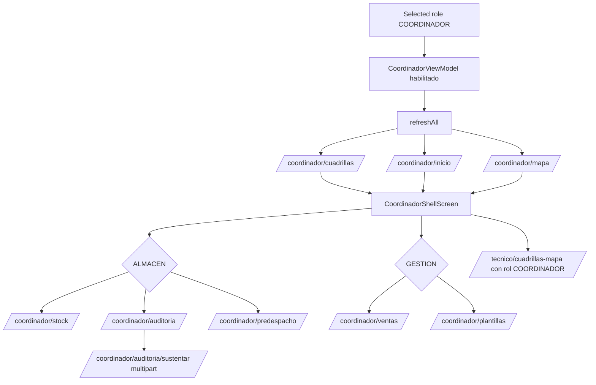

# Coordinador Shell, ViewModel Y Repositorio

Actualizado: 2026-06-18.

Estado: **Revisar**. Deep dive focalizado de la unidad coordinador. Incluye cambios de codigo aplicados el 2026-06-18 para predespacho. No representa validacion visual en dispositivo ni cobertura completa de todos los composables internos.

## Alcance

Fuentes leidas:

- `C:\Proyectos\REDES-MOBILE\app\src\main\java\com\redes\app\ui\screens\CoordinadorShellScreen.kt`
- `C:\Proyectos\REDES-MOBILE\app\src\main\java\com\redes\app\ui\coordinador\CoordinadorViewModel.kt`
- `C:\Proyectos\REDES-MOBILE\app\src\main\java\com\redes\app\ui\coordinador\CoordinadorUiState.kt`
- `C:\Proyectos\REDES-MOBILE\app\src\main\java\com\redes\app\data\coordinador\CoordinadorRepository.kt`
- `C:\Proyectos\REDES-MOBILE\app\src\main\java\com\redes\app\data\coordinador\RemoteCoordinadorRepository.kt`
- `C:\Proyectos\REDES-MOBILE\app\src\main\java\com\redes\app\data\coordinador\CoordinadorModels.kt`
- `C:\Proyectos\REDES-MOBILE\app\src\main\java\com\redes\app\network\dto\CoordinadorDtos.kt`
- `C:\Proyectos\REDES-MOBILE\app\src\main\java\com\redes\app\network\RedesApiClient.kt`
- `C:\Proyectos\REDES-MOBILE\app\src\main\java\com\redes\app\network\MobileEndpoints.kt`
- `C:\Proyectos\REDES-MOBILE\app\src\main\java\com\redes\app\di\AppContainer.kt`
- `C:\Proyectos\REDES-MOBILE\app\src\main\java\com\redes\app\ui\navigation\AppNavHost.kt`

Fuentes relacionadas no profundizadas en esta unidad:

- Backend REDES bajo `C:\Proyectos\REDES\apps\web\src\app\api\mobile\coordinador`
- Pantallas comunes, tema y componentes compartidos.
- Validacion de mapas/Google Maps y picker/camara en dispositivo real.

## Proposito

La unidad coordinador cubre una experiencia operativa para rol `COORDINADOR`: resumen mensual, cuadrillas por dia, mapa de ordenes o cuadrillas, almacen, auditoria de equipos, predespacho, ventas y plantillas pendientes.

`AppContainer.kt` instancia `RemoteCoordinadorRepository(context, apiClient)`. `AppNavHost.kt` entrega `CoordinadorUiState` y callbacks al `CoordinadorShellScreen` cuando el rol seleccionado es `COORDINADOR`.

## Shell Y Secciones UI

`CoordinadorShellScreen.kt` define un shell con cuatro tabs principales:

| Tab | Estado fuente | Contenido visible |
| --- | --- | --- |
| `INICIO` | `CoordInicioTab` | KPIs mensuales, resumen por cuadrilla y navegacion mensual. |
| `CUADRILLAS` | `CoordCuadrillasTab` | Lista o mapa de cuadrillas/ordenes por fecha, selector de dia y detalle expandible. |
| `ALMACEN` | `CoordAlmacenTab` | Subtabs `STOCK`, `AUDITORIA`, `PREDESPACHO`. |
| `GESTION` | `CoordGestionTab` | Subtabs `VENTAS`, `PLANTILLAS`. |

Componentes internos relevantes detectados:

- `CoordCuadrillasLista` y `CoordCuadrillaExpandableCard`: resumen operativo por cuadrilla con ordenes agendadas, iniciadas y finalizadas.
- `CoordCuadrillasMapaView`: alterna entre mapa de ordenes propias y mapa de cuadrillas compartido.
- `CoordAuditoriaContent` y `EquipoAuditoriaRow`: permite sustentar equipos pendientes con foto.
- `CoordPredespachoContent`: muestra requerimientos de equipos/materiales por cuadrilla.
- `CoordVentasContent` y `CoordPlantillasContent`: muestran ventas y pedidos pendientes por cuadrilla.

## Estado UI

`CoordinadorUiState.kt` modela:

- Fechas: `selectedYm` y `selectedYmd` calculadas en zona `America/Lima`.
- Tabs: `CoordinadorTab`, `AlmacenSubTab`, `GestionSubTab`.
- Modos de vista: `CuadrillasViewMode` (`LISTA`/`MAPA`) y `MapaMode` (`MIS_ORDENES`/`CUADRILLAS`).
- Datos remotos: `resumen`, `cuadrillaData`, `mapaItems`, `cuadrillasMapa`, `stock`, `auditoria`, `predespacho`, `ventas`, `plantillas`.
- Estados de carga por seccion y estados expandibles por cuadrilla.
- `auditoriaSustainingSnId` para marcar el equipo cuyo sustento esta en progreso.

## ViewModel

`CoordinadorViewModel` se habilita solo cuando existe usuario autenticado y `sessionRepository.selectedRole == "COORDINADOR"`. Si no se cumple, resetea el estado a `CoordinadorUiState()`.

Responsabilidades principales:

| Metodo | Responsabilidad |
| --- | --- |
| `refreshAll()` | Carga en paralelo resumen mensual, cuadrillas del dia y mapa de ordenes. |
| `selectTab()` | Cambia tab principal y dispara carga lazy segun la seccion. |
| `selectAlmacenSubTab()` | Carga stock, auditoria o predespacho bajo demanda. |
| `selectGestionSubTab()` | Carga ventas o plantillas bajo demanda. |
| `toggleCuadrillasView()` | Alterna lista/mapa en cuadrillas. |
| `toggleMapaMode()` | Alterna mapa de ordenes y mapa de cuadrillas; carga datos si faltan. |
| `sustainAuditoriaEquipo()` | Sube foto de sustento y actualiza localmente el item auditado. |
| `previousMonth()` / `nextMonth()` | Cambian mes y refrescan resumen; limpian ventas/plantillas. |
| `previousDay()` / `nextDay()` / `selectCuadrillasDate()` | Cambian dia operativo y refrescan cuadrillas; `nextDay()` no avanza mas alla de hoy Lima. |

El manejo de errores es parcial: algunas cargas asignan `errorMessage`, pero `refreshMapaItems`, `refreshCuadrillasMapa`, `refreshAuditoria` y `refreshPredespacho` conservan datos previos sin mostrar error si falla la llamada.

## Repositorio Y Endpoints

`CoordinadorRepository` expone las operaciones usadas por el ViewModel:

| Metodo repositorio | Cliente API | Endpoint |
| --- | --- | --- |
| `fetchResumen(ym)` | `fetchCoordinadorResumen` | `/api/mobile/coordinador/inicio?ym=` |
| `fetchCuadrillas(ymd)` | `fetchCoordinadorCuadrillas` | `/api/mobile/coordinador/cuadrillas?ymd=` |
| `fetchMapa(ymd)` | `fetchCoordinadorMapa` | `/api/mobile/coordinador/mapa?ymd=` |
| `fetchCuadrillasMapa()` | `fetchCoordinadorCuadrillasMapa` | `/api/mobile/tecnico/cuadrillas-mapa` |
| `fetchStock()` | `fetchCoordinadorStock` | `/api/mobile/coordinador/stock` |
| `fetchAuditoria()` | `fetchCoordinadorAuditoria` | `/api/mobile/coordinador/auditoria` |
| `fetchPredespacho(ymd)` | `fetchCoordinadorPredespacho` | `/api/mobile/coordinador/predespacho?ymd=` |
| `fetchVentas(year, month)` | `fetchCoordinadorVentas` | `/api/mobile/coordinador/ventas?year=&month=` |
| `fetchPlantillas(ym)` | `fetchCoordinadorPlantillas` | `/api/mobile/coordinador/plantillas?ym=` |
| `sustainEquipo(cuadrillaId, sn, photoUri)` | `sustainCoordinadorEquipo` | `/api/mobile/coordinador/auditoria/sustentar` multipart |

`RemoteCoordinadorRepository.sustainEquipo()` normaliza `sn` a uppercase, limpia `cuadrillaId`, lee bytes desde `ContentResolver`, deriva extension desde MIME type y envia multipart al cliente API. Si no puede leer la foto, falla con `PHOTO_READ_FAILED`.

Todos los requests coordinador agregan `X-Mobile-Role: COORDINADOR`, aunque la autenticacion principal sigue dependiendo del ID token Firebase agregado por `AuthTokenInterceptor`.

## Modelos Y DTOs

Modelos de dominio principales:

- `CoordinadorResumen`, `CoordinadorKpis`, `CoordinadorCuadrillaKpi`, `CoordinadorDiaKpi`.
- `CoordinadorCuadrillaData`, `CoordinadorCuadrilla`, `CoordinadorOrdenesResumen`, `CoordinadorOrdenItem`.
- `CoordinadorMapItem`.
- `CoordinadorStockCuadrilla`, `CoordinadorEquipoStock`.
- `CoordinadorAuditoriaCuadrilla`, `CoordinadorEquipoAuditoria`.
- `CoordinadorPredespacho`, `CoordinadorPredespachoRow` (incluye `precon50/100/150/200` desde 2026-06-18).
- `CoordinadorVenta`.
- `CoordinadorPlantillasCuadrilla`, `CoordinadorPedidoPendiente`.

`CoordinadorDtos.kt` usa parsers `opt*`, por lo que campos faltantes tienden a degradar la UI con valores vacios o cero en lugar de romper parseo. En mapas, los items sin `lat` o `lng` se descartan.

Detalle sensible:

- `toCoordinadorPredespacho()` solo deja `tienePredespacho = true` si el backend envia `tienePredespacho` y ademas hay `rows`.
- `toCoordinadorEquipoAuditoria()` acepta respuesta con objeto `item` o el objeto raiz.
- `fetchCoordinadorCuadrillasMapa()` reutiliza DTO tecnico `CuadrillaMapa`.
- `toPredespachoRowList()` parsea `precon.PRECON_50/100/150/200` desde el objeto `precon` anidado en cada fila.

### Predespacho — cambios 2026-06-18

**Backend (`REDES/apps/web/src/app/api/mobile/coordinador/predespacho/route.ts`):**

- Antes: leia coleccion legacy `instalaciones_predespacho_rows` filtrada por `coordinadorUid` y `anchor == ymd`.
- Ahora: lee `instalaciones_predespacho` (coleccion activa de la web). Consulta en batches de 30 por `cuadrillaId in [ids del coordinador]`, filtra en memoria `startYmd <= ymd <= endYmd` y `!omitida`, y agrega por `cuadrillaId` sumando `final.ONT/MESH/FONO/BOX`. Los campos `precon`, `bobinaResi` y `rolloCondo` vienen solo de documentos `ALL` o `SHARED`. La respuesta incluye `precon: { PRECON_50, PRECON_100, PRECON_150, PRECON_200 }` por fila.

**`CoordinadorPredespachoRow` — campos nuevos (default `0`):**

```kotlin
val precon50: Int = 0
val precon100: Int = 0
val precon150: Int = 0
val precon200: Int = 0
```

**`CoordPredespachoContent` (UI):**

- Chips principales en `Row` con `horizontalScroll`.
- Segunda fila condicional con chips PRE 50/100/150/200, Bobina Resi y Rollo Condo si tienen valor.
- Imports agregados: `horizontalScroll`, `rememberScrollState`.

### Cuadrillas/Lista — cambios 2026-06-18

**Nuevos campos en `CoordinadorOrdenItem`:**
```kotlin
val cantMesh: Int = 0
val cantFono: Int = 0
val cantBox: Int = 0
```
Venian del backend pero no se mostraban. Ahora se incluyen en el parser `toOrdenItemList()`.

**Nuevo modelo `CoordinadorOrdenDetail`:**
Detalle de orden de solo lectura para el coordinador. Campos: `id`, `ordenId`, `cliente`, `codigoCliente`, `documento`, `telefono`, `direccion`, `estado`, `tipoTrabajo`, `tipoServicio`, `fechaProgramadaHm`, `fechaProgramadaYmd`, `isGarantia`, `region`, `cuadrillaId`, `cuadrillaNombre`, `lat`, `lng`, `cantMesh`, `cantFono`, `cantBox`.

**Nuevo endpoint backend:** `GET /api/mobile/coordinador/ordenes/[id]` — devuelve el modelo anterior en `{ ok, item }`. Valida que la orden pertenezca a una cuadrilla del coordinador.

**Stack completo agregado:**
- `MobileEndpoints.coordinadorOrdenDetail(id)`
- `RedesApiClient.fetchCoordinadorOrdenDetail(id)` + DTO `toCoordinadorOrdenDetail()`
- `CoordinadorRepository.fetchOrdenDetail(id)` en interfaz + `RemoteCoordinadorRepository` implementacion
- `CoordinadorUiState`: campos `selectedOrdenDetail: CoordinadorOrdenDetail?` e `isOrdenDetailLoading: Boolean`
- `CoordinadorViewModel`: `loadOrdenDetail(id)` y `clearOrdenDetail()`

**UI — `OrdenItemRow` actualizado:**
- Chips MESH/FONO/BOX visibles junto al chip de estado si el campo es > 0 (`EquipoMiniChip` interno).
- Fila clickeable: `Modifier.clickable { onOrdenClick(orden.id) }`.
- El callback `onOrdenClick: (String) -> Unit` se propaga por toda la cadena: `OrdenItemRow` → `CoordCuadrillaExpandableCard` → `CoordCuadrillasLista` → `CoordCuadrillasTab` → `CoordinadorShellScreen`.

**Nueva pantalla `CoordinadorOrderDetailScreen.kt`:**
Scaffold propio con `TopAppBar` azul. Muestra datos de cliente (nombre, codigo, documento, telefono clickeable para marcar), datos de orden (tipo, servicio, hora, fecha, region, cuadrilla), chips de equipos y direccion con acceso a Google Maps si hay `lat/lng`.

**Navegacion:**
- `AppDestination.CoordinadorOrderDetail` con ruta `coordinador_order_detail/{orderId}`.
- `AppNavHost`: `onCoordinadorOrdenClick` (dispara `loadOrdenDetail` + `navigate`) y `onCoordinadorOrdenDetailBack` (dispara `clearOrdenDetail` + `popBackStack`).
- `MainActivity`: `onCoordinadorOrdenClick = coordinadorViewModel::loadOrdenDetail`, `onCoordinadorOrdenDetailBack = coordinadorViewModel::clearOrdenDetail`.

## Flujo



## Riesgos Y Pendientes

- Revisar si `COORDINADOR_CUADRILLAS_MAPA` debe mantener ruta `/api/mobile/tecnico/cuadrillas-mapa` o migrar a endpoint coordinador propio.
- Validar backend REDES para todos los endpoints coordinador; esta unidad solo leyo el lado Android.
- Validar permisos/UX de foto para `sustainAuditoriaEquipo()` en dispositivo real, incluyendo errores de lectura de URI.
- Revisar manejo de errores silenciosos en mapa, auditoria, predespacho y cuadrillas mapa.
- Revisar textos con mojibake visibles en comentarios/textos de fuente antes de una entrega visual final.
- Documentar modelos/DTOs comparados contra backend en una unidad propia.

## Siguiente Unidad Recomendada

`Force update`, porque sigue como gate transversal de arranque y lee Firestore directo con comportamiento fail-open.
