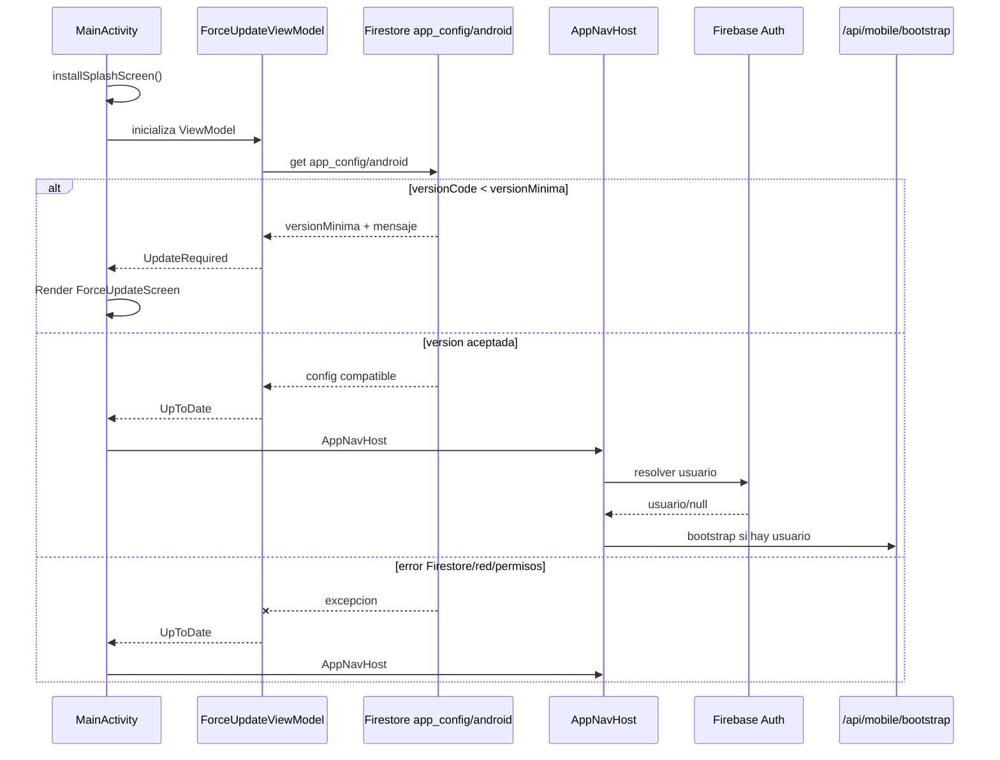

# Force Update

Estado de la unidad: **Revisar**.

Esta unidad documenta el gate de actualizacion obligatoria de REDES-MOBILE. La lectura cubre los archivos principales de force update, el arranque en `MainActivity`, el cruce con splash/navegacion, sesion/bootstrap/cache y el backend REDES para confirmar si existe refuerzo de version minima.

## Fuentes Leidas

REDES-MOBILE:

- `C:\Proyectos\REDES-MOBILE\app\src\main\java\com\redes\app\ui\update\ForceUpdateViewModel.kt`
- `C:\Proyectos\REDES-MOBILE\app\src\main\java\com\redes\app\ui\update\ForceUpdateState.kt`
- `C:\Proyectos\REDES-MOBILE\app\src\main\java\com\redes\app\ui\screens\ForceUpdateScreen.kt`
- `C:\Proyectos\REDES-MOBILE\app\src\main\java\com\redes\app\MainActivity.kt`
- `C:\Proyectos\REDES-MOBILE\app\src\main\java\com\redes\app\ui\screens\SplashScreen.kt`
- `C:\Proyectos\REDES-MOBILE\app\src\main\java\com\redes\app\ui\navigation\AppNavHost.kt`
- `C:\Proyectos\REDES-MOBILE\app\src\main\java\com\redes\app\ui\home\HomeViewModel.kt`
- `C:\Proyectos\REDES-MOBILE\app\src\main\java\com\redes\app\ui\home\HomeUiState.kt`
- `C:\Proyectos\REDES-MOBILE\app\src\main\java\com\redes\app\data\auth\AuthRepository.kt`
- `C:\Proyectos\REDES-MOBILE\app\src\main\java\com\redes\app\data\auth\FirebaseAuthRepository.kt`
- `C:\Proyectos\REDES-MOBILE\app\src\main\java\com\redes\app\data\session\MobileBootstrap.kt`
- `C:\Proyectos\REDES-MOBILE\app\src\main\java\com\redes\app\data\session\MobileSession.kt`
- `C:\Proyectos\REDES-MOBILE\app\src\main\java\com\redes\app\data\session\RemoteSessionRepository.kt`
- `C:\Proyectos\REDES-MOBILE\app\src\main\java\com\redes\app\data\session\SessionRepository.kt`
- `C:\Proyectos\REDES-MOBILE\app\src\main\java\com\redes\app\data\local\SessionCacheDataSource.kt`
- `C:\Proyectos\REDES-MOBILE\app\src\main\java\com\redes\app\network\RedesApiClient.kt`
- `C:\Proyectos\REDES-MOBILE\app\src\main\java\com\redes\app\network\dto\MobileBootstrapDto.kt`

REDES:

- `C:\Proyectos\REDES\apps\web\src\app\api\mobile\bootstrap\route.ts`
- `C:\Proyectos\REDES\apps\web\src\core\auth\mobileBootstrap.ts`
- Busqueda `rg` en `C:\Proyectos\REDES` para `versionMinima`, `versionNominalMinima`, `app_config`, `force update`, `minVersion`, `versionCode` y `bootstrap`.

## Resumen

El force update vive en el cliente Android y se ejecuta antes del flujo normal de autenticacion/navegacion. `ForceUpdateViewModel` consulta Firestore directo en `app_config/android`, compara `BuildConfig.VERSION_CODE` contra `versionMinima` y emite uno de tres estados: `Checking`, `UpToDate` o `UpdateRequired`.

Si el estado es `UpdateRequired`, `MainActivity` renderiza `ForceUpdateScreen` y corta el arbol de navegacion normal. Si el estado es `Checking`, el splash nativo se mantiene en pantalla. Si el estado es `UpToDate`, Android sigue hacia `AppNavHost`, donde recien entran Firebase Auth, bootstrap backend, comunicados, seleccion de rol y shells por rol.

El comportamiento ante error es **fail-open**: cualquier excepcion al consultar Firestore deja pasar al usuario con `UpToDate`. No se encontro refuerzo equivalente en `/api/mobile/bootstrap` ni en el DTO Android de bootstrap.

## Fuente De Configuracion

Fuente observada: Firestore directo desde Android.

- Coleccion: `app_config`
- Documento: `android`
- Consumidor: `ForceUpdateViewModel.fetchAppConfig()`
- API usada: `FirebaseFirestore.getInstance().collection("app_config").document("android").get()`

Campos esperados por el cliente:

| Campo | Tipo esperado | Uso | Default si falta |
| --- | --- | --- | --- |
| `versionMinima` | number/long | Version minima obligatoria contra `BuildConfig.VERSION_CODE` | `0` |
| `versionNominalMinima` | string | Texto visible en UI como version minima | cadena vacia |
| `mensaje` | string | Mensaje visible en pantalla bloqueante | mensaje local generico |

No se observo validacion de existencia del documento. Si el documento existe sin `versionMinima`, o si el campo no puede leerse como `Long`, el cliente cae a `0` o a excepcion segun comportamiento Firestore; ante excepcion entra fail-open.

## Estados

`ForceUpdateState.kt` define:

| Estado | Significado | Efecto |
| --- | --- | --- |
| `Checking` | Estado inicial mientras se lee Firestore | `MainActivity` mantiene splash nativo |
| `UpToDate` | Version local aceptada o error de consulta | Se permite entrar a `AppNavHost` |
| `UpdateRequired(versionNominal, mensaje)` | `BuildConfig.VERSION_CODE < versionMinima` | Se muestra pantalla bloqueante |

`ForceUpdateViewModel` se instancia con `by viewModels()` en `MainActivity`, por lo que `checkVersion()` corre al iniciar la actividad. No se observo reintento manual, listener realtime, cache local ni timeout propio.

## Flujo De Arranque

## Bloqueo UI

`ForceUpdateScreen` es una pantalla Compose de bloqueo completo:

- usa `BackHandler(enabled = true) { }`, por lo que el boton atras no saca al usuario del gate;
- muestra titulo fijo "Actualizacion requerida";
- muestra `versionNominal` solo si no esta en blanco;
- muestra `mensaje` recibido desde Firestore o fallback local;
- ofrece un boton "Actualizar ahora";
- intenta abrir `market://details?id=com.redesmyd.mobile`;
- si falla el intent de Play Store, intenta abrir `https://play.google.com/store/apps/details?id=com.redesmyd.mobile`.

No se observo boton de cerrar, logout, reintentar verificacion, ruta alternativa ni diagnostico de error. El paquete del enlace Play Store esta hardcodeado como `com.redesmyd.mobile`, que coincide con el `applicationId` documentado en `app/build.gradle.kts`.

## Relacion Con Sesion Y Bootstrap

El force update se ejecuta antes del flujo de sesion:

1. `MainActivity` instala el splash y lo mantiene si `ForceUpdateState.Checking`.
2. Al componer, si `UpdateRequired`, se renderiza `ForceUpdateScreen` y se hace `return@REDESTheme`.
3. Solo si no hay update requerido se llama `AppNavHost`.
4. `AppNavHost` espera `uiState.isAuthResolved` y `homeUiState.isStartupReady`; mientras tanto muestra `SplashScreen`.
5. `HomeViewModel` observa Firebase Auth; si hay usuario llama `sessionRepository.fetchBootstrap()`.
6. `RemoteSessionRepository.fetchBootstrap()` pide ID token y llama `/api/mobile/bootstrap`.
7. `MobileBootstrapDto` parsea `session`, `comunicados`, `requiresComunicadosGate`, `roleSelectionRequired` y `defaultRole`.

La cache local de sesion (`SessionCacheDataSource`) no participa en force update. La decision de version no se guarda localmente y no depende de usuario autenticado, rol, comunicados, permisos ni backend configurado.

## Cruce Backend REDES

La busqueda en REDES no encontro implementacion backend que valide `versionMinima`, `versionNominalMinima`, `app_config`, `versionCode`, `minVersion` o force update para mobile.

El endpoint `/api/mobile/bootstrap`:

- valida contexto mobile con `getMobileAuthContext(req)`;
- construye sesion, comunicados, `requiresComunicadosGate`, `roleSelectionRequired` y `defaultRole`;
- no devuelve campos de version minima ni bloqueo de update.

`MobileBootstrapDto` en Android tampoco espera campos de version. Con la evidencia actual, el control de version minima depende solo de Firestore directo desde Android.

## Manejo De Error Y Fail-Open

El `catch` de `ForceUpdateViewModel.checkVersion()` captura cualquier `Exception` y emite `UpToDate`. La intencion esta explicitada en comentario de fuente: ante error de red no bloquea.

Consecuencias:

- si Firestore esta caido, sin red, denegado por rules o con error transitorio, el usuario entra igual;
- si `app_config/android` no es accesible para builds reales por reglas, el force update queda inefectivo;
- si el documento esta mal tipado y produce excepcion, tambien se permite acceso;
- si el documento existe pero `versionMinima` falta, se usa `0`, por lo que casi cualquier build queda aceptado;
- el backend no tiene segunda barrera para rechazar clientes bajo version minima.

Esta decision puede ser deseable para disponibilidad, pero requiere validacion humana porque fuerza una compensacion clara: disponibilidad de campo versus capacidad de bloquear versiones incompatibles.

## Correcciones Detectadas En Fuente (2026-06-21)

- **Regla Firestore agregada en `firebase/firestore.rules` de REDES**: `match /app_config/{docId} { allow get: if true; }`. La lectura publica sin auth es necesaria porque el check ocurre antes de que el usuario inicie sesion. El documento solo contiene metadata de version (no datos sensibles). No se verifico deploy/emulador desde esta revision.
- **Causa raiz del bug**: sin esta regla, `fetchAppConfig()` lanzaba `PERMISSION_DENIED`, el `catch` emitia `UpToDate` y el force update nunca se disparaba (fail-open sistematico).

## Proceso Operativo — Actualizar Version Minima

Cada vez que se publique una nueva version en Play Store que deba ser obligatoria, actualizar manualmente en Firestore Console el documento `app_config/android`:

| Campo | Tipo | Ejemplo |
|---|---|---|
| `versionMinima` | number | `7` (el `versionCode` minimo aceptado) |
| `versionNominalMinima` | string | `"1.0.6"` (visible en UI) |
| `mensaje` | string | `"Hay una nueva versión disponible. Actualiza para continuar."` |

La comparacion en Android es `BuildConfig.VERSION_CODE < versionMinima`. Si `versionMinima = 7`, todos los builds con `versionCode < 7` veran la pantalla bloqueante. Los que ya tienen `versionCode >= 7` pasan.

Actualmente `versionCode = 7` en produccion. Si la siguiente version es `versionCode = 8`, poner `versionMinima = 8` para bloquear las anteriores.

## Riesgos Y Decisiones Pendientes

- **Decision fail-open**: ante error de red real (no de permisos) el usuario sigue entrando. Confirmar si es comportamiento aceptable.
- **Refuerzo backend**: `/api/mobile/bootstrap` no valida version minima. Si un usuario modifica la app para saltear el gate cliente, no hay segunda barrera en el servidor.
- **Deploy de rules**: validar que la regla `app_config` ya este publicada en Firebase, no solo presente en fuente.
- **Sin automatizacion**: la actualizacion de `app_config/android` es un paso manual post-release; considerar script o Cloud Function que lo actualice automaticamente.
- **Tipado de config**: definir contrato operativo del documento Firestore y responsable de actualizar `versionMinima`.
- **UX de bloqueo**: evaluar si se requiere reintento, soporte, logout o mensaje diferenciado cuando Play Store no abre.
- **Observabilidad**: no se observo log/evento/metric para saber cuantos usuarios quedan bloqueados o cuantos entran por fail-open.
- **Timeout/reintento**: la lectura usa `get()` sin timeout/retry propio; ante una tarea que tarde, el splash puede quedar activo hasta que Firestore resuelva.
- **Mojibake**: hay textos con mojibake visibles en fuentes Kotlin; revisar codificacion antes de entrega visual final.

## Estado De Cierre

Unidad marcada como **Revisar**. Los archivos clave fueron leidos y el flujo queda documentado, pero no corresponde marcarla como `Documentado` cerrado hasta resolver las decisiones de fail-open, refuerzo backend y operacion del documento Firestore.

Siguiente unidad recomendada: **Tecnico alertas/notificaciones y cierre de ruta**.
