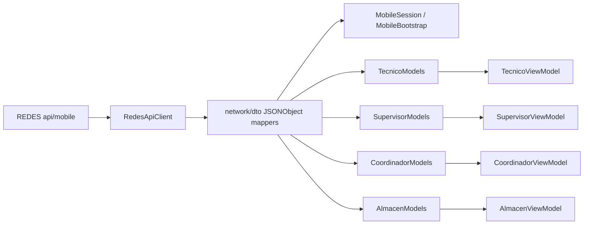

# Modelos Y DTOs Android Contra Backend REDES

Actualizado: 2026-06-22.

Estado: **Revisar**. Esta unidad cruza los modelos de dominio Android y los parseadores JSON con los endpoints mobile de REDES. No valida ejecucion real ni esquemas Firestore completos.

## Alcance Leido

REDES-MOBILE:

- `app/src/main/java/com/redes/app/network/dto/MobileSessionDto.kt`
- `app/src/main/java/com/redes/app/network/dto/MobileBootstrapDto.kt`
- `app/src/main/java/com/redes/app/network/dto/TecnicoDtos.kt`
- `app/src/main/java/com/redes/app/network/dto/SupervisorDtos.kt`
- `app/src/main/java/com/redes/app/network/dto/CoordinadorDtos.kt`
- `app/src/main/java/com/redes/app/network/dto/AlmacenDtos.kt`
- `app/src/main/java/com/redes/app/data/tecnico/TecnicoModels.kt`
- `app/src/main/java/com/redes/app/data/supervisor/SupervisorModels.kt`
- `app/src/main/java/com/redes/app/data/coordinador/CoordinadorModels.kt`
- `app/src/main/java/com/redes/app/data/almacen/AlmacenModels.kt`

REDES:

- `apps/web/src/core/auth/mobileBootstrap.ts`
- `apps/web/src/app/api/mobile/bootstrap/route.ts`
- `apps/web/src/app/api/mobile/me/route.ts`
- `apps/web/src/app/api/mobile/tecnico/**/route.ts`
- `apps/web/src/app/api/mobile/supervisor/**/route.ts`
- `apps/web/src/app/api/mobile/coordinador/**/route.ts`
- `apps/web/src/app/api/mobile/almacen/**/route.ts`

## Patron General

Android no usa DTOs serializados por libreria; parsea `JSONObject`/`JSONArray` manualmente en `network/dto`.

Consecuencias:

- Campos faltantes degradan a `""`, `0`, `false`, `null` o listas vacias por uso de `opt*`.
- No hay error visible cuando REDES cambia el contrato pero mantiene JSON valido.
- Los campos numericos toleran `Number` o `String` solo donde se usa `optNullableDouble` o `optTimestampMillis`.
- Los items de mapa con `lat/lng` nulos se descartan silenciosamente.
- El campo `ok` de las respuestas se valida en `RedesApiClient`; los mapeadores asumen que el body exitoso ya llego.

## Sesion Y Bootstrap

| Android | Fuente backend | Forma esperada | Observaciones |
| --- | --- | --- | --- |
| `MobileBootstrapDto` | `/api/mobile/bootstrap` | `session`, `comunicados`, `requiresComunicadosGate`, `roleSelectionRequired`, `defaultRole` | No espera campos de version minima; force update vive fuera del bootstrap. |
| `MobileSessionDto` | `buildMobileBootstrap()` y `/api/mobile/me` | `uid`, `nombre`, `nombreCorto`, `email`, `roles`, `areas`, `permissions`, `estadoAcceso`, `isAdmin` | Si `nombre` falta cae a `uid`; si `estadoAcceso` falta cae a `INHABILITADO`. |
| `MobileComunicadoDto` | bootstrap | `id`, `titulo`, `cuerpo`, `obligatorio`, `persistencia`, `placement`, `target`, urls opcionales | Defaults Android: `persistencia=ONCE`, `placement=PAGE`, `target=ALL`. |

Riesgo: `roles` puede incluir roles web que no tienen shell Android. La decision de entrada esta documentada en `session-auth-bootstrap.md` y `navigation.md`.

## Tecnico

| Modelo Android | Endpoint REDES | Campos clave | Notas de contrato |
| --- | --- | --- | --- |
| `TecnicoHomeData` | `/api/mobile/tecnico/home` | `fecha`, `tecnico`, `cuadrilla`, `kpis`, `equipmentSummary`, `cableado`, `plantillasPendientes` | `cableado` y `plantillasPendientes` son extensiones tolerantes a ausencia. |
| `TecnicoOrdersData` | `/api/mobile/tecnico/ordenes` | `ymd`, `updateInfo`, `items` | `updateInfo.at` puede ser null si viene vacio. |
| `TecnicoOrderSummary` | `/tecnico/ordenes` | orden, cliente, estado, fechas, garantia, liquidacion, `cantMesh/cantFono/cantBox`, ubicacion | `lat/lng` son opcionales. |
| `TecnicoOrderDetail` | `/api/mobile/tecnico/ordenes/[id]` | detalle completo, `servicios`, `materiales`, `equipos`, `acta` | `materiales` y `equipos` se parsean como listas anidadas. |
| `TecnicoStockData` | `/api/mobile/tecnico/stock` | `cuadrilla`, `equipos`, `materiales`, `bobinas` | Acepta alias backend `f_despachoYmd` y `guia_despacho`. |
| `TecnicoMapData` | `/api/mobile/tecnico/mapa` | `ymd`, `cuadrilla`, `items` | Items sin coordenadas se omiten. |
| `CuadrillaMapa` | `/api/mobile/tecnico/cuadrillas-mapa` | `id`, `nombre`, `categoria`, `vehiculo`, `lat/lng`, `lastLocationAt`, `estadoActual` | Usado tambien por coordinador para mapa de cuadrillas. |

Hallazgos:

- `TecnicoStockAuditoria.actualizadoEn` acepta timestamp Firestore, `Date`, numero o string numerico, aunque el endpoint HTTP normalmente entrega JSON plano.
- `TecnicoOrderSummary` y `CoordinadorOrdenItem` ya esperan `cantMesh/cantFono/cantBox`; esto cubre el cambio reciente de lista de cuadrillas.
- La degradacion silenciosa puede esconder cambios de nombres de campos en stock, auditoria o plantillas.

## Supervisor

| Modelo Android | Endpoint REDES | Campos clave | Notas de contrato |
| --- | --- | --- | --- |
| `SupervisorHomeData` | `/api/mobile/supervisor/home` | `ymd`, `supervisor`, `trackingHabilitado`, `regionesHoy`, `cuadrillasHoy`, `ordenesPorRegion`, `totales` | `trackingHabilitado` cae a `true` si falta. |
| `SupervisorOrdersData` | `/api/mobile/supervisor/ordenes` | `ymd`, `updateInfo`, `items` | `items` se mapean a `SupervisorOrderSummary`. |
| `SupervisorOrderDetail` | `/api/mobile/supervisor/ordenes/[id]` | detalle de orden, garantia, `supervision` opcional | `supervision` se omite si el objeto no existe. |
| `SupervisorMapItem` | `/api/mobile/supervisor/mapa` | orden, cliente, garantia, cuadrilla, region, supervision, coordenadas | Items sin `lat/lng` se descartan. |
| `JornadaData` / `SupervisorJornada` | `/api/mobile/supervisor/jornada` | `jornada`, `oficina`, estado, horas y coordenadas | Estado desconocido cae a `SIN_INICIAR`. |

Hallazgos:

- `SupervisorMapMode.CUADRILLAS` existe en dominio UI, pero el endpoint dedicado de cuadrillas devuelve items compatibles con `CuadrillaMapa` desde DTO tecnico, no `SupervisorMapItem`.
- Los campos de garantia (`diagnosticoGarantia`, `solucionGarantia`, `responsableGarantia`, etc.) caen a string vacio si backend no los entrega.
- El modelo de alertas supervisor (`SupervisorAlertItem`) es local/in-memory; no forma parte de contrato backend.

## Coordinador

| Modelo Android | Endpoint REDES | Campos clave | Notas de contrato |
| --- | --- | --- | --- |
| `CoordinadorResumen` | `/api/mobile/coordinador/inicio` | `ym`, `resumen`, `cuadrillas[].dias` | Totales mapeados a `CoordinadorKpis`. |
| `CoordinadorCuadrillaData` | `/api/mobile/coordinador/cuadrillas` | `ymd`, `updateInfo`, `cuadrillas` | Si no hay cuadrillas asignadas, backend puede devolver solo `cuadrillas: []`; Android deja `ymd` vacio. |
| `CoordinadorOrdenItem` | `/coordinador/cuadrillas` | orden compacta, hora, tipo, direccion, `cantMesh/cantFono/cantBox` | Usado para lista expandible por cuadrilla. |
| `CoordinadorOrdenDetail` | `/api/mobile/coordinador/ordenes/[id]` | `item` con detalle de orden | DTO acepta wrapper `item` o body directo. |
| `CoordinadorMapItem` | `/api/mobile/coordinador/mapa` | orden, cuadrilla, coordenadas | Items sin coordenadas se omiten. |
| `CoordinadorStockCuadrilla` | `/api/mobile/coordinador/stock` | conteos `ont/mesh/fono/box/total`, `equipos` | Equipo stock solo conserva `sn` y `tipo`. |
| `CoordinadorAuditoriaCuadrilla` | `/api/mobile/coordinador/auditoria` | conteos e `items` con `sn/tipo/estado/fotoURL` | Sustento devuelve `item` y se mapea a `CoordinadorEquipoAuditoria`. |
| `CoordinadorPredespacho` | `/api/mobile/coordinador/predespacho` | `tienePredespacho`, `ymd`, `rows`, `precon` | `tienePredespacho` se fuerza a false si `rows` esta vacio. |
| `CoordinadorVenta` | `/api/mobile/coordinador/ventas` | `items` con montos en cents y cuotas | No hay conversion monetaria en DTO. |
| `CoordinadorPlantillasCuadrilla` | `/api/mobile/coordinador/plantillas` | `pendientesByCuadrilla`, `pedidos` | Si `ym` invalido, backend responde error; DTO solo cubre exito. |

Hallazgos:

- `CoordinadorCuadrillaData` espera `ymd`, pero la rama backend sin cuadrillas asignadas devuelve `{ ok: true, cuadrillas: [] }`; la UI recibira `ymd=""`.
- `CoordinadorPredespachoRow` parsea `precon.PRECON_50/100/150/200`; si backend cambia nombres o mayusculas, se mostraran ceros.
- `CoordinadorOrdenDetail` es tolerante al wrapper `item`, alineado con el endpoint nuevo `/coordinador/ordenes/[id]`.
- El mapa de cuadrillas del coordinador sigue dependiendo del contrato tecnico `CuadrillaMapa` cuando se usa `/api/mobile/tecnico/cuadrillas-mapa`.

## Almacen

| Modelo Android | Endpoint REDES | Campos clave | Notas de contrato |
| --- | --- | --- | --- |
| `AlmacenStockCuadrilla` | `/api/mobile/almacen/stock` | `cuadrillaId`, `cuadrillaNombre`, conteos `ont/mesh/fono/box/total`, `equipos` | El DTO espera arreglo `cuadrillas`; equipos conservan `sn` y `tipo`. |
| `AlmacenLiquidacionData` | `/api/mobile/almacen/liquidacion?ym=YYYY-MM` | `ym`, `items`, `kpi` | `cantMesh/cantFono/cantBox` se parsean como string con default `"0"`. |
| `AlmacenInstalacion` | `/api/mobile/almacen/instalaciones?ym=YYYY-MM` | cliente, cuadrilla, fecha, acta, SNs, precon, bobina, `estadoMateriales` | `snMesh` y `snBox` son listas; `estadoMateriales` cae a `pendiente` si falta. |
| `CuadrillaMapa` | `/api/mobile/tecnico/cuadrillas-mapa` con header `ALMACEN` | cuadrilla, vehiculo, coordenadas y estado actual | Reutiliza modelo ubicado en `data/tecnico`, no en un paquete comun. |

Hallazgos:

- Los DTOs de almacen siguen el mismo patron manual con `opt*`, por lo que un contrato incompleto puede mostrarse como stock cero, listas vacias o textos vacios.
- `AlmacenLiquidacionItem` representa cantidades como string, mientras otros roles usan enteros para conteos MESH/FONO/BOX.
- `AlmacenInstalacion.estadoMateriales` depende de la respuesta backend y no recalcula localmente si acta/precon cambian de forma.

## Contratos A Vigilar

| Riesgo | Evidencia | Impacto |
| --- | --- | --- |
| Degradacion silenciosa por `opt*` | Todos los DTOs manuales en `network/dto` | Cambios backend pueden aparecer como ceros/vacios en UI sin error. |
| Ramas backend de lista vacia sin metadata | `/coordinador/cuadrillas`, `/coordinador/stock`, `/coordinador/auditoria`, `/coordinador/plantillas` | Algunos modelos pierden `ymd/ym/updateInfo` o muestran defaults. |
| Coordenadas nulas descartadas | `toMapItems`, `toSupervisorMapItems`, `toCoordinadorMapItemList`, `toCuadrillasMapaList` | Ordenes/cuadrillas pueden no aparecer en mapas sin mensaje especifico. |
| Uso compartido de contrato tecnico | `CuadrillaMapa` y `/tecnico/cuadrillas-mapa` | Coordinador/supervisor dependen de campos pensados originalmente para tecnico. |
| Uso compartido de contrato tecnico por almacen | `ALMACEN_CUADRILLAS_MAPA` apunta a `/tecnico/cuadrillas-mapa` | Almacen tambien depende de `CuadrillaMapa` tecnico para su mapa. |
| Mojibake en textos fuente | Comentarios/modelos y UI ya observados en unidades previas | Riesgo visual/documental; no afecta parsing pero debe revisarse antes de entrega. |

## Diagrama De Mapeo

## Pendientes De Revision

- Agregar pruebas de contrato o fixtures JSON para endpoints mobile criticos antes de cambios grandes de backend.
- Definir si los DTOs deben fallar fuerte para campos obligatorios en vez de degradar silenciosamente.
- Alinear ramas vacias de endpoints coordinador para que siempre devuelvan metadata esperada (`ymd`, `ym`, `updateInfo`) cuando aplique.
- Confirmar si `CuadrillaMapa` debe moverse a modelo comun en vez de vivir bajo `data/tecnico`.
- Agregar fixtures JSON para los endpoints de almacen y decidir si `cantMesh/cantFono/cantBox` deben ser enteros o strings en liquidacion.
- Revisar mojibake en fuentes Android antes de cierre visual.

## Siguiente Unidad Recomendada

Repositorios por rol restantes y manejo de errores/resultados, porque ya se conoce el contrato de datos y falta cerrar como cada repositorio propaga fallas hacia ViewModels.
