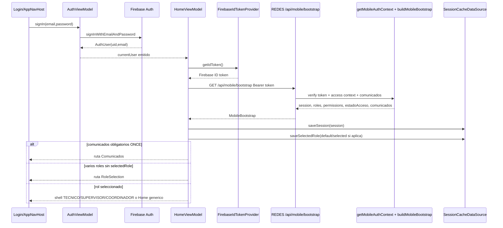
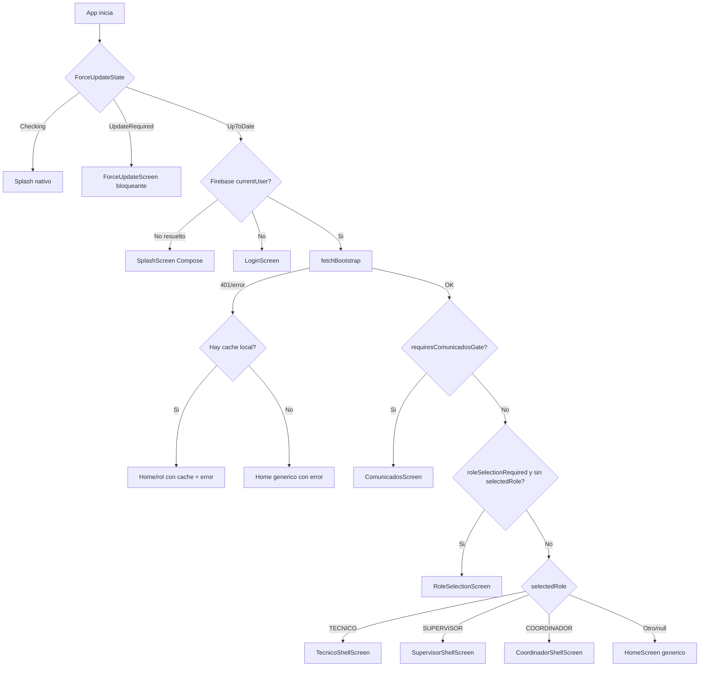

# Sesion, Auth, Bootstrap Y Force Update - REDES-MOBILE

Actualizado: 2026-06-14.

Estado de la unidad: **Revisar**. La lectura cubre login Firebase, token provider/interceptor, bootstrap contra REDES, cache local, seleccion de rol, comunicados obligatorios, force update y dependencias directas de entrada de app. No cubre toda la navegacion ni todos los ViewModels por rol.

## Alcance Leido

Android:

- `C:\Proyectos\REDES-MOBILE\app\src\main\java\com\redes\app\REDESApplication.kt`
- `C:\Proyectos\REDES-MOBILE\app\src\main\java\com\redes\app\MainActivity.kt`
- `C:\Proyectos\REDES-MOBILE\app\src\main\java\com\redes\app\di\AppContainer.kt`
- `C:\Proyectos\REDES-MOBILE\app\src\main\java\com\redes\app\data\auth\AuthRepository.kt`
- `C:\Proyectos\REDES-MOBILE\app\src\main\java\com\redes\app\data\auth\FirebaseAuthRepository.kt`
- `C:\Proyectos\REDES-MOBILE\app\src\main\java\com\redes\app\data\session\*.kt`
- `C:\Proyectos\REDES-MOBILE\app\src\main\java\com\redes\app\data\local\SessionCacheDataSource.kt`
- `C:\Proyectos\REDES-MOBILE\app\src\main\java\com\redes\app\network\FirebaseIdTokenProvider.kt`
- `C:\Proyectos\REDES-MOBILE\app\src\main\java\com\redes\app\network\AuthTokenInterceptor.kt`
- `C:\Proyectos\REDES-MOBILE\app\src\main\java\com\redes\app\network\RedesApiClient.kt`
- `C:\Proyectos\REDES-MOBILE\app\src\main\java\com\redes\app\network\MobileEndpoints.kt`
- `C:\Proyectos\REDES-MOBILE\app\src\main\java\com\redes\app\network\dto\MobileBootstrapDto.kt`
- `C:\Proyectos\REDES-MOBILE\app\src\main\java\com\redes\app\network\dto\MobileSessionDto.kt`
- `C:\Proyectos\REDES-MOBILE\app\src\main\java\com\redes\app\ui\auth\*.kt`
- `C:\Proyectos\REDES-MOBILE\app\src\main\java\com\redes\app\ui\home\*.kt`
- `C:\Proyectos\REDES-MOBILE\app\src\main\java\com\redes\app\ui\update\*.kt`
- `C:\Proyectos\REDES-MOBILE\app\src\main\java\com\redes\app\ui\screens\RoleSelectionScreen.kt`
- `C:\Proyectos\REDES-MOBILE\app\src\main\java\com\redes\app\ui\screens\ComunicadosScreen.kt`
- `C:\Proyectos\REDES-MOBILE\app\src\main\java\com\redes\app\ui\screens\HomeScreen.kt`
- `C:\Proyectos\REDES-MOBILE\app\src\main\java\com\redes\app\ui\screens\ForceUpdateScreen.kt`
- `C:\Proyectos\REDES-MOBILE\app\src\main\java\com\redes\app\ui\navigation\AppNavHost.kt`, solo lo necesario para gates de auth/comunicados/rol/home.

Backend cruzado:

- `C:\Proyectos\REDES\apps\web\src\core\auth\mobile.ts`
- `C:\Proyectos\REDES\apps\web\src\core\auth\mobileBootstrap.ts`
- `C:\Proyectos\REDES\apps\web\src\core\auth\accessContext.ts`
- `C:\Proyectos\REDES\apps\web\src\core\auth\accessContext.cached.ts`
- `C:\Proyectos\REDES\apps\web\src\core\rbac\homeRoute.ts`
- `C:\Proyectos\REDES\apps\web\src\app\api\mobile\bootstrap\route.ts`
- `C:\Proyectos\REDES\apps\web\src\app\api\mobile\me\route.ts`
- `C:\Proyectos\REDES\apps\web\src\domain\comunicados\service.ts`

No encontrado:

- `C:\Proyectos\REDES-MOBILE\app\src\main\java\com\redes\app\network\dto\MobileDtos.kt`. Los DTOs reales estan separados en `MobileBootstrapDto.kt` y `MobileSessionDto.kt`.

## Entrada De App Y DI

- `REDESApplication` instancia `DefaultAppContainer` y registra `presenceManager` como observer de ciclo de vida de proceso.
- `DefaultAppContainer` crea `FirebaseAuth`, `FirebaseAuthRepository`, `FirebaseIdTokenProvider`, `OkHttpClient` con `AuthTokenInterceptor`, `RedesApiClient`, `SessionCacheDataSource` y `RemoteSessionRepository`.
- `MainActivity` crea `ForceUpdateViewModel`, `AuthViewModel`, `HomeViewModel` y ViewModels por rol. Antes de mostrar `AppNavHost`, evalua `ForceUpdateState`; si hay `UpdateRequired`, muestra `ForceUpdateScreen` y corta el flujo normal.

## Flujo Login Firebase

1. `LoginScreen` llama `AuthViewModel.signIn`.
2. `AuthViewModel` valida email/password y llama `AuthRepository.signIn`.
3. `FirebaseAuthRepository.signIn` ejecuta `FirebaseAuth.signInWithEmailAndPassword` y retorna `AuthUser(uid, email)`.
4. `FirebaseAuthRepository.currentUser` emite cambios via `FirebaseAuth.AuthStateListener`.
5. `AuthViewModel.observeAuthState` actualiza `AuthUiState.currentUser` e `isAuthResolved`.
6. `HomeViewModel.observeAuthState` detecta usuario Firebase. Si hay usuario, ejecuta `refreshBackendSession`; si no hay usuario, cancela refresh, limpia cache y resetea sesion.

Errores Firebase mapeados en Android:

- `ERROR_INVALID_EMAIL` -> correo no valido.
- `ERROR_INVALID_CREDENTIAL`, `ERROR_WRONG_PASSWORD`, `ERROR_USER_NOT_FOUND` -> credenciales incorrectas.
- `ERROR_USER_DISABLED` -> usuario deshabilitado.
- `ERROR_TOO_MANY_REQUESTS` -> demasiados intentos.
- `ERROR_NETWORK_REQUEST_FAILED` -> sin conexion.

## Token Provider E Interceptor

- `FirebaseIdTokenProvider.getIdToken(forceRefresh = false)` lee `firebaseAuth.currentUser`; si existe, llama `currentUser.getIdToken(forceRefresh)` y devuelve el token.
- `AuthTokenInterceptor` agrega `Authorization: Bearer <token>` a requests OkHttp que no tengan ya ese header.
- `RedesApiClient.fetchBootstrap(idToken)` y `fetchCurrentSession(idToken)` agregan el header manualmente, aunque el cliente global tambien tiene interceptor.
- La mayoria de endpoints por rol dependen del interceptor; `fetchBootstrap` depende de `RemoteSessionRepository` obteniendo primero el ID token.

## Bootstrap Contra REDES

1. `HomeViewModel.refreshBackendSession` llama `SessionRepository.fetchBootstrap`.
2. `RemoteSessionRepository.fetchBootstrap` falla temprano si `RedesApiClient.isConfigured` es falso.
3. `RemoteSessionRepository` pide ID token a `TokenProvider`; si no hay Firebase session, devuelve error.
4. `RedesApiClient.fetchBootstrap` hace `GET /api/mobile/bootstrap` con Bearer token.
5. Backend valida token y acceso habilitado en `getMobileAuthContext`.
6. Backend arma respuesta con `buildMobileBootstrap`.
7. Android parsea con `MobileBootstrapDto.fromJson`.
8. `RemoteSessionRepository` guarda `bootstrap.session` en `SessionCacheDataSource`.
9. `HomeViewModel.applyBootstrap` decide `selectedRole`, comunicados y estado de startup.

Respuesta esperada por Android:

| Campo | Uso Android | Fuente backend |
| --- | --- | --- |
| `session.uid` | Identidad backend cacheada y mostrada | `mobileBootstrap.ts` |
| `session.nombre`, `nombreCorto`, `email` | Perfil visible | `mobile.ts`, `mobileBootstrap.ts` |
| `session.roles` | Role selection, shells y validacion de selected role | `accessContext.ts`, `mobileBootstrap.ts` |
| `session.areas` | Informacion de perfil/home | `accessContext.ts` |
| `session.permissions` | Se muestra en Home; no se usa para gates Android leidos | `accessContext.ts` |
| `session.estadoAcceso` | Se cachea/muestra; si no es habilitado backend ya no deja entrar | `mobile.ts` |
| `session.isAdmin` | Se cachea; Android no lo usa para routing directo en esta unidad | `mobileBootstrap.ts` |
| `comunicados` | Gate de comunicados y lista de lectura | `mobileBootstrap.ts`, `domain/comunicados/service.ts` |
| `requiresComunicadosGate` | Fuerza ruta `Comunicados` antes de rol/home | `mobileBootstrap.ts` |
| `roleSelectionRequired` | Fuerza `RoleSelection` si hay mas de un rol y no hay selected role | `mobileBootstrap.ts` |
| `defaultRole` | Autoseleccion si no requiere selector | `core/rbac/homeRoute.ts` |

## Cache Local Y Selected Role

`SessionCacheDataSource` usa DataStore `redes_session` con dos claves:

- `session_json`: serializa `MobileSession` completa.
- `selected_role`: guarda el rol seleccionado normalizado a uppercase.

Reglas observadas:

- `RemoteSessionRepository.fetchBootstrap` solo guarda `session`; `selectedRole` se guarda en `HomeViewModel.applyBootstrap` o `selectRole`.
- `observeCachedSession` repuebla `backendSession` desde DataStore y marca `isUsingCachedSession = true`.
- `observeSelectedRole` acepta el rol cacheado si `allowedRoles` esta vacio o contiene el rol. Esto permite mostrar un rol cacheado antes de que llegue la sesion backend, y luego lo filtra cuando hay roles.
- `applyBootstrap` conserva `currentSelected` si sigue dentro de `bootstrap.session.roles`; si no, usa `defaultRole` solo cuando `roleSelectionRequired` es falso.
- `selectRole` ignora roles no incluidos en `backendSession.roles`.
- `clearSelectedRole` elimina la clave local y vuelve a forzar selector si hay varios roles.
- Logout desde `MainActivity.handleLogout` detiene tracking, marca presence sign-out y llama `AuthViewModel.signOut`; al caer `currentUser = null`, `HomeViewModel` limpia cache.

Riesgo de cache stale:

- Si hay sesion cacheada y el refresh de bootstrap falla, `HomeViewModel` conserva `backendSession` anterior y muestra estado de error junto con cache. Si `selectedRole` cacheado existe, `AppNavHost` puede entrar a un shell por rol antes de que backend confirme permisos actuales; las llamadas posteriores deberian fallar por auth/backend, pero la UI inicial puede verse stale.
- En produccion backend cachea access context con TTL de `ACCESS_CONTEXT_CACHE_TTL_MS`, default `60000` ms, en `accessContext.cached.ts`. Cambios de roles/permisos pueden tardar hasta ese TTL salvo invalidacion.

## Comunicados Gate

Backend:

- `listPendingComunicadosForUser` filtra comunicados `ACTIVO`, rango visible y target `ALL`, `ROLES`, `AREAS` o `USERS`.
- `persistencia=ONCE` se muestra solo si no existe `usuarios_access/{uid}/comunicados_reads/{id}`.
- `persistencia=ALWAYS` se muestra siempre.
- `buildMobileBootstrap` marca `requiresComunicadosGate` si hay algun comunicado `obligatorio` y `persistencia === "ONCE"`.

Android:

- `MobileComunicado.isBlocking` tambien considera blocking solo cuando `obligatorio && persistencia == ONCE`.
- `AppNavHost` envia a `Comunicados` si `homeUiState.requiresComunicadosGate` es verdadero, antes de role selection.
- `ComunicadosScreen` permite marcar visto. `HomeViewModel.markComunicadoSeen` llama `POST /api/mobile/comunicados/{id}/seen` y luego refresca bootstrap.
- La ruta backend `apps/web/src/app/api/mobile/comunicados/[id]/seen/route.ts` fue validada con `Get-Content -LiteralPath`: autentica con `getMobileAuthContext`, rechaza `comunicadoId` vacio y persiste visto con `markMobileComunicadoSeen(mobile.uid, comunicadoId)`.
- Los comunicados `ALWAYS` pueden mostrarse en la lista si backend los devuelve, pero no bloquean porque el gate solo considera `ONCE`.

## Seleccion De Rol Y Home

Backend:

- `buildMobileBootstrap` normaliza roles a uppercase.
- `roleSelectionRequired = roles.length > 1`.
- `defaultRole = getDefaultRoleForRoles(roles)`.
- Prioridad backend de default role: `TI`, `RRHH`, `SUPERVISOR`, `SEGURIDAD`, `GERENCIA`, `JEFATURA`, `ALMACEN`, `GESTOR`, `COORDINADOR`, `TECNICO`.

Android:

- `RoleSelectionScreen` lista todos los roles recibidos en `backendSession.roles`.
- Tiene nombre/icono/descripcion especial para `TECNICO`, `COORDINADOR`, `SUPERVISOR`, `ADMIN`, `GERENCIA`, `SEGURIDAD`; otros roles se muestran genericamente.
- `AppNavHost` solo tiene shells especializados para `TECNICO`, `SUPERVISOR` y `COORDINADOR`.
- Si `selectedRole` es otro rol (`ADMIN`, `GERENCIA`, `TI`, `RRHH`, `JEFATURA`, `ALMACEN`, `GESTOR`, `SEGURIDAD`), cae al `HomeScreen` generico.

Inconsistencia de rol:

- Backend puede autoseleccionar un rol web de mayor prioridad que no tiene shell Android. Ejemplo: usuario con `SUPERVISOR` y `TECNICO` queda por defecto en `SUPERVISOR`; usuario con `TI` y `TECNICO` queda por defecto en `TI` y Android muestra home generico, no shell tecnico.
- Android no usa `permissions` para habilitar/deshabilitar shells; solo `selectedRole`.

## Usuario Deshabilitado O No Autorizado

Firebase:

- Si Firebase Auth devuelve `ERROR_USER_DISABLED`, Android lo muestra en login.

Backend:

- `getMobileAuthContext` verifica token con `adminAuth().verifyIdToken(token, true)`.
- Si no existe `usuarios_access/{uid}` o `estadoAcceso` no normaliza a `HABILITADO`, retorna `null`.
- Las rutas `/api/mobile/bootstrap` y `/api/mobile/me` devuelven `401 UNAUTHENTICATED` cuando `getMobileAuthContext` retorna `null`.
- Android mapea 401 de `RedesApiClient` como "El backend rechazo el token de Firebase.", aunque tambien puede representar usuario sin acceso o inhabilitado.

Riesgo de UX:

- Usuario Firebase valido pero sin `usuarios_access` habilitado se presenta como rechazo de token, no como "sin acceso" o "usuario inhabilitado".

## Force Update

`ForceUpdateViewModel` no depende del backend mobile:

- Lee Firestore directo: `app_config/android`.
- Compara `BuildConfig.VERSION_CODE` contra `versionMinima`.
- Si la version local es menor, emite `ForceUpdateState.UpdateRequired(versionNominal, mensaje)`.
- `MainActivity` mantiene splash mientras `Checking` y muestra `ForceUpdateScreen` si aplica.
- `ForceUpdateScreen` bloquea back y abre Play Store o URL web para `com.redesmyd.mobile`.
- Si falla la lectura Firestore, el ViewModel marca `UpToDate` y deja entrar.

Inconsistencia/ambiguedad:

- El gate de force update es fail-open ante error de red/Firestore. Esto evita bloquear por caidas, pero puede permitir versiones vencidas si no se puede leer `app_config/android`.
- No hay evidencia leida de que backend `/api/mobile/bootstrap` refuerce version minima.

## Diagrama De Secuencia

## Diagrama De Decision

## Hallazgos E Inconsistencias

1. `/api/mobile/me` existe en Android y backend, pero no se encontro consumidor directo en el flujo actual. El flujo real usa `/api/mobile/bootstrap`.
2. Android recibe `permissions` y los muestra, pero no se encontro uso para gating de UI mobile en esta unidad.
3. Backend puede devolver roles web que Android muestra en selector, pero solo `TECNICO`, `SUPERVISOR` y `COORDINADOR` tienen shell especializado.
4. `defaultRole` backend prioriza roles web antes que `COORDINADOR`/`TECNICO`; eso puede llevar a home generico en mobile aunque el usuario tenga un rol operativo.
5. Cache local puede mostrar sesion/rol previo si bootstrap falla; backend protege llamadas posteriores, pero la UX puede quedar stale.
6. Usuario con Firebase valido pero `estadoAcceso` no habilitado recibe 401 y Android lo muestra como token rechazado, no como acceso deshabilitado/no autorizado.
7. Force update es Firestore directo y fail-open ante error; no se observo refuerzo desde bootstrap.
8. Mensajes Android de 404 para bootstrap/me siguen diciendo que endpoints no existen, aunque ambos existen.

## Estado Final De La Unidad

**Revisar** por las inconsistencias anteriores. La lectura de archivos clave fue completada, pero conviene decision humana sobre:

- Si mobile debe filtrar roles a `TECNICO`, `SUPERVISOR`, `COORDINADOR` o soportar roles web.
- Si `defaultRole` para mobile debe tener prioridad distinta a web.
- Si 401 por acceso inhabilitado debe distinguirse de token invalido.
- Si cache stale debe bloquear shells operativos hasta bootstrap fresco.
- Si force update debe reforzarse desde backend.

## Siguiente Unidad Recomendada

`Navegacion y destinos por rol REDES-MOBILE`, cruzada con roles backend y shells por rol, sin entrar aun a pantallas operativas completas.
