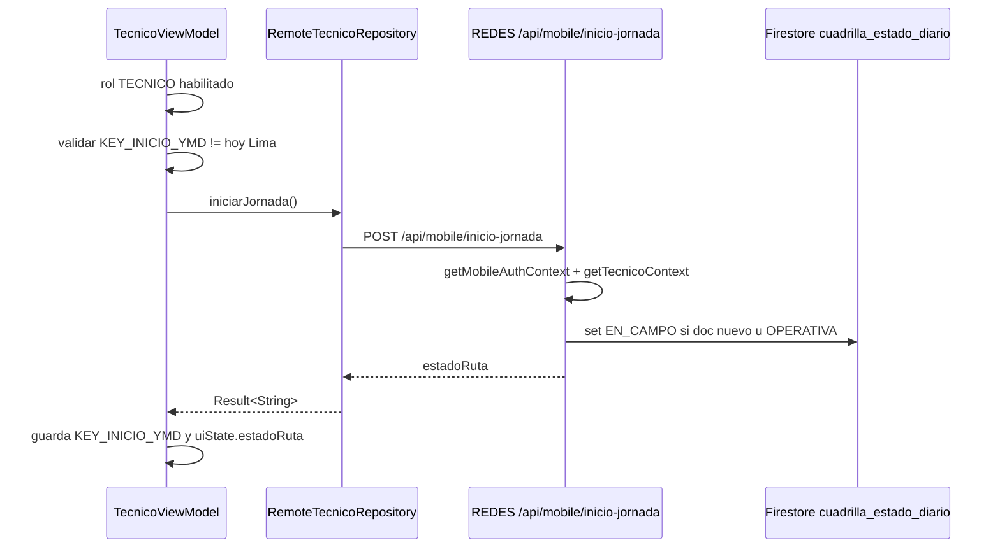
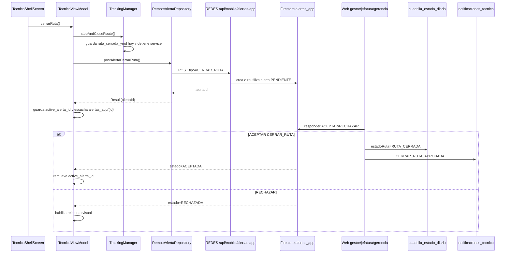

# Tecnico Alertas, Notificaciones Y Cierre De Ruta

Actualizado: 2026-06-18.

Estado de la unidad: **Revisar**. Se leyeron los archivos clave Android y backend indicados para el flujo tecnico. La unidad no queda `Documentado` porque hay decisiones humanas pendientes sobre autorizacion final del cierre, reglas Firestore, reinicio de tracking y diferencia con supervisor.

## Alcance Leido

REDES-MOBILE:

- `C:\Proyectos\REDES-MOBILE\app\src\main\java\com\redes\app\ui\tecnico\TecnicoViewModel.kt`
- `C:\Proyectos\REDES-MOBILE\app\src\main\java\com\redes\app\ui\tecnico\TecnicoUiState.kt`
- `C:\Proyectos\REDES-MOBILE\app\src\main\java\com\redes\app\ui\screens\TecnicoShellScreen.kt`
- `C:\Proyectos\REDES-MOBILE\app\src\main\java\com\redes\app\ui\screens\NotificationsScreen.kt`
- `C:\Proyectos\REDES-MOBILE\app\src\main\java\com\redes\app\data\tecnico\RemoteTecnicoRepository.kt`
- `C:\Proyectos\REDES-MOBILE\app\src\main\java\com\redes\app\data\tecnico\TecnicoRepository.kt`
- `C:\Proyectos\REDES-MOBILE\app\src\main\java\com\redes\app\data\tecnico\TecnicoModels.kt`
- `C:\Proyectos\REDES-MOBILE\app\src\main\java\com\redes\app\data\alertas\RemoteAlertaRepository.kt`
- `C:\Proyectos\REDES-MOBILE\app\src\main\java\com\redes\app\data\alertas\AlertaRepository.kt`
- `C:\Proyectos\REDES-MOBILE\app\src\main\java\com\redes\app\data\alertas\AlertaApp.kt`
- `C:\Proyectos\REDES-MOBILE\app\src\main\java\com\redes\app\data\tracking\TrackingManager.kt`
- `C:\Proyectos\REDES-MOBILE\app\src\main\java\com\redes\app\data\tracking\LocationTrackingService.kt`
- `C:\Proyectos\REDES-MOBILE\app\src\main\java\com\redes\app\data\tracking\TrackingRepository.kt`
- `C:\Proyectos\REDES-MOBILE\app\src\main\java\com\redes\app\network\MobileEndpoints.kt`
- `C:\Proyectos\REDES-MOBILE\app\src\main\java\com\redes\app\network\RedesApiClient.kt`
- `C:\Proyectos\REDES-MOBILE\app\src\main\java\com\redes\app\network\dto\TecnicoDtos.kt`

REDES backend/web:

- `C:\Proyectos\REDES\apps\web\src\app\api\mobile\alertas-app\route.ts`
- `C:\Proyectos\REDES\apps\web\src\app\api\mobile\inicio-jornada\route.ts`
- `C:\Proyectos\REDES\apps\web\src\app\api\mobile\tracking\route.ts`
- `C:\Proyectos\REDES\apps\web\src\app\api\mobile\tecnico\home\route.ts`
- `C:\Proyectos\REDES\apps\web\src\app\api\mobile\tecnico\ordenes\route.ts`
- `C:\Proyectos\REDES\apps\web\src\app\api\mobile\tecnico\ordenes\[id]\route.ts`
- `C:\Proyectos\REDES\apps\web\src\app\api\mobile\tecnico\mapa\route.ts`
- `C:\Proyectos\REDES\apps\web\src\app\api\mobile\tecnico\cuadrillas-mapa\route.ts`
- `C:\Proyectos\REDES\apps\web\src\app\api\alertas-app\[id]\responder\route.ts`
- `C:\Proyectos\REDES\apps\web\src\domain\alertas-app\repo.ts`
- `C:\Proyectos\REDES\apps\web\src\domain\ordenes\notificaciones-tecnico.ts`

Docs cruzadas revisadas para no duplicar: `android\network.md`, `android\repositories.md`, `android\tracking.md` y `C:\Proyectos\REDES\docs\contexto\web\api-routes.md`.

## Resumen Ejecutivo

El tecnico tiene tres flujos conectados pero no equivalentes:

1. **Jornada/ruta diaria**: `TecnicoViewModel` llama `tecnicoRepository.iniciarJornada()` una vez por dia local Lima. Android consume `/api/mobile/inicio-jornada`; backend crea o actualiza `cuadrilla_estado_diario/{ymd}_{cuadrillaId}` a `EN_CAMPO` solo si estaba `OPERATIVA`. No sobreescribe `RUTA_CERRADA`.
2. **Cierre tecnico de ruta**: el boton "Cerrar ruta" no cierra la ruta directamente en backend. Primero Android ejecuta `TrackingManager.stopAndCloseRoute()` y luego publica una alerta `CERRAR_RUTA` via `/api/mobile/alertas-app`. La ruta queda efectivamente cerrada en backend solo si un usuario web permitido responde la alerta con `ACEPTAR`.
3. **Notificaciones del tecnico**: `RemoteAlertaRepository.listenNotificaciones` escucha Firestore directo en `notificaciones_tecnico/{cuadrillaId}/items`, y `NotificationsScreen` muestra esos items junto con comunicados del home.

## Estado UI Tecnico

`TecnicoUiState` concentra el estado del shell:

- `estadoRuta`: respuesta de `/api/mobile/inicio-jornada`, por ejemplo `EN_CAMPO`, `OPERATIVA` o `RUTA_CERRADA`.
- `alertaPendienteId`: id de la alerta activa de cierre, persistido en `SharedPreferences` `redes_alertas`.
- `alertaEstado`: estado Firestore de `alertas_app/{alertaId}` (`PENDIENTE`, `ACEPTADA`, `RECHAZADA`).
- `isAlertaLoading`: loading local al publicar alerta de cierre.
- `notifItems` y `notifCount`: items leidos desde `notificaciones_tecnico`.
- `home`, `ordersData`, `stock`, `map` y `cuadrillasMapa`: datos operativos consumidos por tabs de inicio, ordenes, stock y mapa.

En `TecnicoShellScreen`, el estado visible de ruta usa una regla local: si `alertaEstado == "ACEPTADA"`, muestra `RUTA_CERRADA`; si no, usa `estadoRuta`. Esto puede adelantar visualmente el cierre sin refrescar `inicio-jornada`, pero depende de que el listener de alerta reciba el cambio.

## Flujo De Inicio De Jornada



Evidencia:

- Android: `TecnicoViewModel.iniciarJornada`, `RemoteTecnicoRepository.iniciarJornada`, `RedesApiClient.postInicioJornada`.
- Backend: `apps\web\src\app\api\mobile\inicio-jornada\route.ts`.
- Store: `cuadrilla_estado_diario` con doc id `${ymd}_${cuadrillaId}`.

## Flujo De Cierre De Ruta Tecnico



Puntos importantes:

- `TrackingManager.stopAndCloseRoute()` ocurre antes de confirmar que `/api/mobile/alertas-app` respondio OK. Si falla la publicacion de alerta, Android ya guardo `ruta_cerrada_ymd` y detuvo el tracking local.
- `/api/mobile/alertas-app` no cambia `cuadrilla_estado_diario`; solo crea o reutiliza una alerta `PENDIENTE`.
- El cierre definitivo `RUTA_CERRADA` ocurre en `apps\web\src\app\api\alertas-app\[id]\responder\route.ts` cuando la accion es `ACEPTAR` y el tipo es `CERRAR_RUTA`.
- Backend antduplica alertas pendientes por `cuadrillaId + tipo + estado=PENDIENTE` y devuelve el `alertaId` existente.
- `TecnicoViewModel.restoreAlertaListener()` restaura un listener si hay `active_alerta_id` del mismo dia. Si la alerta era de otro dia, limpia preferencias.

## Flujo De Requiere Atencion

`TecnicoViewModel.requerirAtencion()` llama `RemoteAlertaRepository.postRequiereAtencion()`, que publica `tipo=REQUIERE_ATENCION` en `/api/mobile/alertas-app`.

El backend mobile crea o reutiliza una alerta `PENDIENTE` en `alertas_app` con:

- `rolesDestino`: `GESTOR`, `JEFATURA`, `GERENCIA`.
- `cuadrillaId`, `cuadrillaNombre`, `emisorUid`, `emisorNombre`.
- `ymd` calculado en `America/Lima`.

Cuando web responde `ACEPTAR`, `apps\web\src\app\api\alertas-app\[id]\responder\route.ts` genera una notificacion `ATENCION_ATENDIDA` en `notificaciones_tecnico/{cuadrillaId}/items`. Si web rechaza, solo cambia el estado de la alerta; no se observo notificacion de rechazo para el tecnico.

## Flujo De Notificaciones Tecnico

```mermaid
flowchart TD
  A[fetchHome tecnico] --> B{cuadrilla.id valido}
  B -->|si| C[startNotifListener]
  C --> D[Firestore notificaciones_tecnico/{cuadrillaId}/items]
  D --> E[RemoteAlertaRepository.listenNotificaciones]
  E --> F[uiState.notifItems + notifCount]
  F --> G[AppTopBar badge]
  F --> H[NotificationsScreen]
  H --> I[onNotificationsOpened]
  I --> J[markNotificacionesLeidas batch update leido=true]
```

`TecnicoViewModel.refreshAll()` inicia el listener de notificaciones solo cuando `fetchHome()` devuelve `home.cuadrilla.id` no vacio. `onNotificationsOpened()` hace una actualizacion optimista del badge a cero y luego escribe `leido=true` en Firestore para ids no leidos.

`NotificationsScreen` separa:

- **Alertas de gestion**: `NotifTecnicoItem` desde `notificaciones_tecnico`.
- **Comunicados**: `HomeUiState.comunicados`, del flujo de bootstrap/sesion.

Tipos renderizados por la pantalla:

- `CERRAR_RUTA_APROBADA`
- `ATENCION_ATENDIDA`
- `REQUIERE_ATENCION`
- `ORDEN_NUEVA`
- `ORDEN_QUITADA`
- `ESTADO_ORDEN`
- `TRAMO_ALERTA`
- `ORDENES_ACTUALIZADAS`
- `CIERRE_RUTA_RECORDATORIO`

Fuentes backend confirmadas:

- Respuesta web de alerta crea `CERRAR_RUTA_APROBADA` o `ATENCION_ATENDIDA`.
- `sendNotifTecnico` en `domain\ordenes\notificaciones-tecnico.ts` crea items genericos para cambios de ordenes.

## Endpoints Y Consumidores

| Flujo | Android | Endpoint/backend | Store/efecto |
| --- | --- | --- | --- |
| Inicio jornada | `TecnicoViewModel.iniciarJornada` -> `RemoteTecnicoRepository.iniciarJornada` | `POST /api/mobile/inicio-jornada` | `cuadrilla_estado_diario/{ymd}_{cuadrillaId}` en `EN_CAMPO` si procede |
| Crear alerta cierre | `cerrarRuta` -> `RemoteAlertaRepository.postAlertaCerrarRuta` | `POST /api/mobile/alertas-app`, body `tipo=CERRAR_RUTA` | `alertas_app/{id}` `PENDIENTE`; antduplicado por alerta pendiente |
| Crear alerta atencion | `requerirAtencion` -> `postRequiereAtencion` | `POST /api/mobile/alertas-app`, body `tipo=REQUIERE_ATENCION` | `alertas_app/{id}` `PENDIENTE` |
| Escuchar alerta | `listenAlertaEstado(alertaId)` | Firestore directo | Lee `alertas_app/{alertaId}.estado` |
| Responder alerta | Web `POST /api/alertas-app/{id}/responder` | No es mobile; requiere sesion web y rol permitido | Actualiza alerta; si acepta cierre, escribe `RUTA_CERRADA`; notifica al tecnico |
| Inbox tecnico | `listenNotificaciones(cuadrillaId)` | Firestore directo | Lee `notificaciones_tecnico/{cuadrillaId}/items`, ultimos 30 |
| Marcar leidas | `markNotificacionesLeidas` | Firestore directo batch update | `leido=true` por item |
| Tracking tecnico | `LocationTrackingService` -> `TrackingRepository.postLocation` | `POST /api/mobile/tracking` | `cuadrillas/{id}` y subcoleccion `tracking` |
| Mapa cuadrillas | `fetchTecnicoCuadrillasMapa` | `GET /api/mobile/tecnico/cuadrillas-mapa` | Excluye cuadrillas con `RUTA_CERRADA` hoy |

## Relacion Con Tracking Y Presencia

El cierre tecnico afecta tracking local y backend de forma separada:

- Local: `TrackingManager.stopAndCloseRoute()` guarda `ruta_cerrada_ymd` en `SharedPreferences` `redes_tracking` y envia `ACTION_STOP` a `LocationTrackingService`.
- Automatico diario: `TrackingManager.startIfNeeded()` no arranca si `ruta_cerrada_ymd` coincide con hoy o si `last_start_ymd` ya coincide con hoy.
- Backend: solo la respuesta web aceptada cambia `cuadrilla_estado_diario` a `RUTA_CERRADA`.
- Mapa de cuadrillas: `/api/mobile/tecnico/cuadrillas-mapa` consulta `cuadrilla_estado_diario` para excluir cuadrillas con `RUTA_CERRADA` del dia.

Presencia online/offline esta documentada en `android\tracking.md`. En esta unidad no se observo que `cerrarRuta()` marque presencia offline; solo detiene tracking.

## Diferencias Con Supervisor

- Tecnico: cierre desde app es una solicitud aprobable. Detiene tracking local con `stopAndCloseRoute()` y espera `alertas_app`.
- Supervisor: cierre de ruta usa jornada supervisor (`FIN_RUTA`) segun `android\supervisor-shell-alertas.md`; no pasa por `alertas_app` de cierre tecnico y no marca `ruta_cerrada_ymd` con `stopAndCloseRoute()`.
- Backend tecnico: `/api/mobile/inicio-jornada` exige `getTecnicoContext`; el metodo homonimo expuesto en repositorio supervisor queda como inconsistencia ya registrada.
- Notificaciones tecnico: `NotificationsScreen` consume `notificaciones_tecnico`; las alertas supervisor documentadas antes son locales/en memoria o de flujo supervisor, no el mismo inbox persistido.

## Manejo De Errores Y Offline

Android usa `Result<T>` en repositorios:

- `RemoteTecnicoRepository` captura `RedesApiException` y excepciones generales.
- `RemoteAlertaRepository` captura excepciones al publicar alerta y devuelve `Result.failure`.
- `TecnicoViewModel.cerrarRuta()` muestra `errorMessage` con `e.localizedMessage` si falla `/api/mobile/alertas-app`.
- `listenAlertaEstado` ignora errores de snapshot y no informa UI.
- `listenNotificaciones` emite lista vacia si hay error de snapshot.
- `markNotificacionesLeidas` no devuelve resultado ni expone error.
- `postRequiereAtencion()` no actualiza UI ni muestra error si falla.

No se encontro cache offline propio para alertas/notificaciones aparte del cache local de `SharedPreferences` para `active_alerta_id`, `active_alerta_ymd` e `inicio_jornada_ymd`. Firestore puede tener comportamiento offline por SDK si esta configurado por defecto, pero esta unidad no valido configuracion de persistencia ni rules.

## Riesgos

1. **Cierre local antes de confirmacion remota**: `cerrarRuta()` detiene tracking y bloquea reinicio automatico diario antes de saber si la alerta fue creada.
2. **Doble fuente de verdad visual**: UI muestra `RUTA_CERRADA` cuando `alertaEstado=ACEPTADA`, mientras el estado oficial consultado por mapa/backend vive en `cuadrilla_estado_diario`.
3. **Rechazo y tracking**: si la alerta se rechaza, UI permite reintentar, pero `TrackingManager` ya dejo `ruta_cerrada_ymd` de hoy y no reinicia automaticamente tracking.
4. **Firestore directo desde Android**: Android lee `alertas_app` y `notificaciones_tecnico`, y escribe `leido=true`; requiere validar reglas Firestore.
5. **Errores silenciosos**: listeners Firestore y `postRequiereAtencion()` no exponen feedback al usuario.
6. **Notificaciones persistidas vs en memoria**: tecnico usa inbox persistido; supervisor tiene alertas locales documentadas en otra unidad. Conviene definir contrato unificado si ambos roles deben compartir campana.
7. **Foreground service/permisos**: cierre e inicio dependen de permisos y estado de foreground service ya documentados como `Revisar`; falta validacion Android 13/14.
8. **Mojibake en textos fuente**: se observaron textos con caracteres mal codificados en comentarios/labels; afecta calidad visual si llega a UI.
9. **Antduplicado limitado**: backend reutiliza una alerta `PENDIENTE` por tipo/cuadrilla, pero no evita nuevas alertas tras rechazo o aceptacion.

## Decisiones Humanas Pendientes

- Confirmar si el tecnico debe detener tracking antes o despues de que `/api/mobile/alertas-app` confirme creacion de alerta.
- Definir si una alerta `RECHAZADA` debe reactivar tracking automaticamente o limpiar `ruta_cerrada_ymd`.
- Validar si el estado visual `ACEPTADA -> RUTA_CERRADA` basta o si Android debe refrescar `inicio-jornada`/home despues de aceptacion.
- Revisar Firestore rules para lectura de `alertas_app`, lectura/escritura de `notificaciones_tecnico` y seguridad por cuadrilla.
- Decidir si los rechazos de cierre/atencion deben generar notificaciones al tecnico.
- Confirmar si `NotificationsScreen` debe ser tecnico-only o si supervisor/coordinador tendran inbox persistido equivalente.
- Validar en dispositivo real permisos de ubicacion/notificaciones, foreground service, background/doze y comportamiento de reintento.

## Lo Que Queda Fuera

- No se revisaron Firebase rules.
- No se ejecuto app, backend, emulador ni pruebas en dispositivo.
- No se documento en detalle `TecnicoOrderDetailScreen` ni stock tecnico; solo se cruzaron repositorios/DTOs necesarios.
- No se modifico codigo fuente, Gradle, configs, package files, lockfiles, credenciales ni binarios.

## Siguiente Unidad Recomendada

**Modelos/DTOs tecnico-supervisor-coordinador contra backend REDES**, priorizando campos sensibles que hoy usan `opt*` y pueden degradar UI sin error visible.
