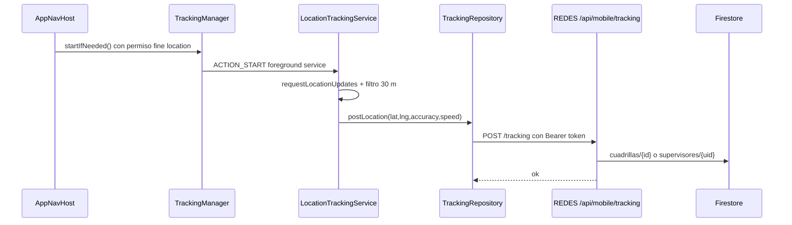
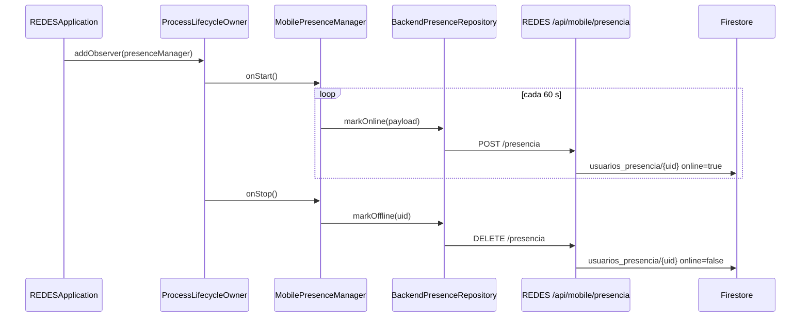

# Tracking Y Presencia - REDES-MOBILE

Actualizado: 2026-06-14.

Estado de la unidad: **Revisar**. Esta lectura cubre el flujo sensible de ubicacion en foreground service y presencia online/offline. No se modifico codigo fuente.

## Archivos Leidos

Android REDES-MOBILE:

- `C:\Proyectos\REDES-MOBILE\app\src\main\AndroidManifest.xml`
- `C:\Proyectos\REDES-MOBILE\app\src\main\java\com\redes\app\REDESApplication.kt`
- `C:\Proyectos\REDES-MOBILE\app\src\main\java\com\redes\app\MainActivity.kt`
- `C:\Proyectos\REDES-MOBILE\app\src\main\java\com\redes\app\di\AppContainer.kt`
- `C:\Proyectos\REDES-MOBILE\app\src\main\java\com\redes\app\ui\navigation\AppNavHost.kt`
- `C:\Proyectos\REDES-MOBILE\app\src\main\java\com\redes\app\data\tracking\TrackingManager.kt`
- `C:\Proyectos\REDES-MOBILE\app\src\main\java\com\redes\app\data\tracking\LocationTrackingService.kt`
- `C:\Proyectos\REDES-MOBILE\app\src\main\java\com\redes\app\data\tracking\TrackingRepository.kt`
- `C:\Proyectos\REDES-MOBILE\app\src\main\java\com\redes\app\data\presence\MobilePresenceManager.kt`
- `C:\Proyectos\REDES-MOBILE\app\src\main\java\com\redes\app\data\presence\PresenceRepository.kt`
- `C:\Proyectos\REDES-MOBILE\app\src\main\java\com\redes\app\data\presence\PresencePayload.kt`
- `C:\Proyectos\REDES-MOBILE\app\src\main\java\com\redes\app\data\presence\BackendPresenceRepository.kt`
- `C:\Proyectos\REDES-MOBILE\app\src\main\java\com\redes\app\data\presence\FirestorePresenceRepository.kt`
- `C:\Proyectos\REDES-MOBILE\app\src\main\java\com\redes\app\network\RedesApiClient.kt`
- `C:\Proyectos\REDES-MOBILE\app\src\main\java\com\redes\app\network\MobileEndpoints.kt`
- Lectura puntual de `TecnicoViewModel.kt` y `SupervisorViewModel.kt` para confirmar arranque/cierre de tracking.

Backend REDES relacionado:

- `C:\Proyectos\REDES\apps\web\src\app\api\mobile\tracking\route.ts`
- `C:\Proyectos\REDES\apps\web\src\app\api\mobile\presencia\route.ts`
- `C:\Proyectos\REDES\apps\web\src\app\api\mobile\supervisor\jornada\route.ts`

## Permisos Y Registro Android

`AndroidManifest.xml` declara:

- `INTERNET`
- `ACCESS_FINE_LOCATION`
- `ACCESS_COARSE_LOCATION`
- `FOREGROUND_SERVICE`
- `FOREGROUND_SERVICE_LOCATION`
- `POST_NOTIFICATIONS`

Tambien registra `.data.tracking.LocationTrackingService` como servicio no exportado, habilitado y con `foregroundServiceType="location"`.

La solicitud runtime de permisos ocurre en `AppNavHost`:

- Rol `TECNICO`: si `ACCESS_FINE_LOCATION` ya esta concedido, llama `onStartTracking`; si no, solicita ubicacion fina y, en Android 13+, notificaciones. Solo inicia tracking desde el callback si se concede ubicacion fina.
- Rol `SUPERVISOR`: si `ACCESS_FINE_LOCATION` ya esta concedido, llama `onStartSupervisorTracking`; tambien solicita ubicacion fina si falta y notificaciones en Android 13+ si falta. El callback arranca tracking si se concede ubicacion fina.
- Rol `COORDINADOR`: no inicia tracking en esta lectura.

## Flujo De Tracking

1. `MainActivity` pasa `appContainer.trackingManager::startIfNeeded` a la navegacion para tecnico y supervisor.
2. `AppNavHost` llama ese callback al entrar al shell de rol con permiso de ubicacion fina concedido.
3. `TrackingManager.startIfNeeded` calcula la fecha actual con zona `America/Lima`.
4. Si `ruta_cerrada_ymd` o `last_start_ymd` ya coinciden con hoy, no vuelve a arrancar.
5. Si corresponde, guarda `last_start_ymd` y lanza `LocationTrackingService` con `ACTION_START` usando `startForegroundService` desde Android O.
6. `LocationTrackingService.startTracking` crea una notificacion persistente y pide ubicaciones a Play Services Location con:
   - intervalo deseado: 60 s
   - intervalo minimo: 30 s
   - retraso maximo: 120 s
   - distancia minima: 30 m
   - prioridad: `PRIORITY_BALANCED_POWER_ACCURACY`
7. Cada ubicacion pasa por `movedEnough`; el primer punto se publica y luego solo se publica si se movio al menos 30 m desde el ultimo punto enviado correctamente.
8. `TrackingRepository.postLocation` delega en `RedesApiClient.postTracking`.
9. `RedesApiClient.postTracking` envia JSON `{ lat, lng, accuracy?, speed? }` a `/api/mobile/tracking` con header `X-Mobile-Role: TECNICO`.
10. `AuthTokenInterceptor` agrega `Authorization: Bearer <Firebase ID token>` si el request no trae authorization.

## Cierre De Tracking

Hay tres cierres visibles:

- Logout: `MainActivity.handleLogout` llama `trackingManager.stop()` y `presenceManager.onSignedOut()`.
- Tecnico: `TecnicoViewModel.cerrarRuta` llama `trackingManager.stopAndCloseRoute()` antes de publicar alerta de cierre de ruta. Esto guarda `ruta_cerrada_ymd` para evitar reinicio automatico el mismo dia.
- Supervisor: `SupervisorViewModel.confirmarCerrarRuta` llama `trackingManager.stop()` antes de registrar `FIN_RUTA`; no marca `ruta_cerrada_ymd`, por lo que el bloqueo diario local queda menos estricto que en tecnico.

`LocationTrackingService.onDestroy` remueve location updates, cancela su scope IO y baja el foreground service.

## Contrato Backend De Tracking

`/api/mobile/tracking` en REDES:

- Valida Firebase/mobile auth con `getMobileAuthContext`.
- Permite roles `TECNICO`, `SUPERVISOR` o `ADMIN`.
- Exige `lat` y `lng` numericos; `accuracy` y `speed` son opcionales.
- Usa fecha `America/Lima` para `ymd`.
- Para supervisor no admin: escribe en `supervisores/{uid}` y `supervisores/{uid}/tracking/{ymd_timestamp}`.
- Para tecnico/admin: resuelve cuadrilla con `getTecnicoContext` y escribe en `cuadrillas/{cuadrillaId}` y `cuadrillas/{cuadrillaId}/tracking/{ymd_timestamp}`.
- Devuelve 404 `TECNICO_WITHOUT_CUADRILLA` si el rol tecnico/admin no puede resolver cuadrilla.

El backend decide por roles del token, no por `X-Mobile-Role`. Por eso el header fijo `TECNICO` en Android no rompe hoy el tracking supervisor, pero queda como riesgo si el backend empieza a confiar en ese header.

## Flujo De Presencia

1. `REDESApplication.onCreate` registra `appContainer.presenceManager` como observer del `ProcessLifecycleOwner`.
2. `MobilePresenceManager.onStart` arranca un loop en IO si no hay uno activo.
3. El loop ejecuta `syncOnline()` inmediatamente y luego cada 60 s.
4. `syncOnline` requiere `authRepository.currentUser.first()`; si no hay usuario, no marca presencia.
5. Lee `sessionRepository.cachedSession.first()` para construir `PresencePayload` con `uid`, `roles` y `areas`.
6. La implementacion activa en DI es `BackendPresenceRepository`, que ignora el payload local y llama `RedesApiClient.markPresenceOnline()`.
7. `onStop` cancela el loop y lanza `syncOffline()`.
8. `onSignedOut` hace lo mismo para logout explicito.

`FirestorePresenceRepository` sigue en el codigo como implementacion alternativa directa a Firestore, pero `DefaultAppContainer` usa `BackendPresenceRepository`.

## Contrato Backend De Presencia

`/api/mobile/presencia` en REDES:

- `POST`: valida mobile auth y escribe `usuarios_presencia/{uid}` con `online=true`, `source=MOBILE`, roles/areas/estadoAcceso desde el backend y timestamps de servidor.
- `DELETE`: si no hay mobile auth devuelve `{ ok: true }`; si hay auth, escribe `online=false`, `source=MOBILE`, `lastSeenAt` y `updatedAt`.
- Los errores del `DELETE` se absorben y responden `{ ok: true }`.

Esto hace que presencia sea best-effort: fallas de red o auth quedan logueadas en Android, pero no bloquean la app.

## Diagrama

## Riesgos Y Decisiones Pendientes

1. `RedesApiClient.postTracking` usa `X-Mobile-Role: TECNICO` tambien para supervisor. Hoy backend ignora ese header para tracking, pero conviene alinear el header o remover dependencia futura.
2. `LocationTrackingService.startTracking` esta anotado con `@SuppressLint("MissingPermission")`; la proteccion real depende de `AppNavHost`. Si otro caller arranca el servicio sin permiso, no hay check defensivo dentro del servicio.
3. `TrackingManager.startIfNeeded` guarda `last_start_ymd` antes de confirmar que el servicio arranco o que el permiso sigue vigente.
4. El cierre tecnico usa `stopAndCloseRoute` y bloquea reinicio automatico el mismo dia; el cierre supervisor usa `stop` y podria permitir reinicio si el shell vuelve a llamar `startIfNeeded`.
5. Presencia via backend ignora `PresencePayload`; roles/areas salen del backend, lo cual es correcto para autoridad, pero deja obsoleto parte del payload local.
6. `FirestorePresenceRepository` existe pero no esta conectado por DI; mantenerlo o retirarlo requiere decision.
7. `markPresenceOnline`, `markPresenceOffline` y `postTracking` retornan silenciosamente si `API_BASE_URL` no esta configurado; el usuario no ve error explicito de presencia/tracking desactivado.
8. No se valido en dispositivo real el comportamiento de foreground service con permisos Android 13/14 ni restricciones de bateria.

## Estado Documental

- Tracking/presencia queda documentado con estado **Revisar** por riesgos de permisos, header de rol, diferencia de cierre tecnico/supervisor y verificacion en dispositivo.
- Siguiente unidad recomendada: **Supervisor shell/ViewModel y alertas**, porque supervisor combina jornada, tracking, mapa y cierre de ruta.
