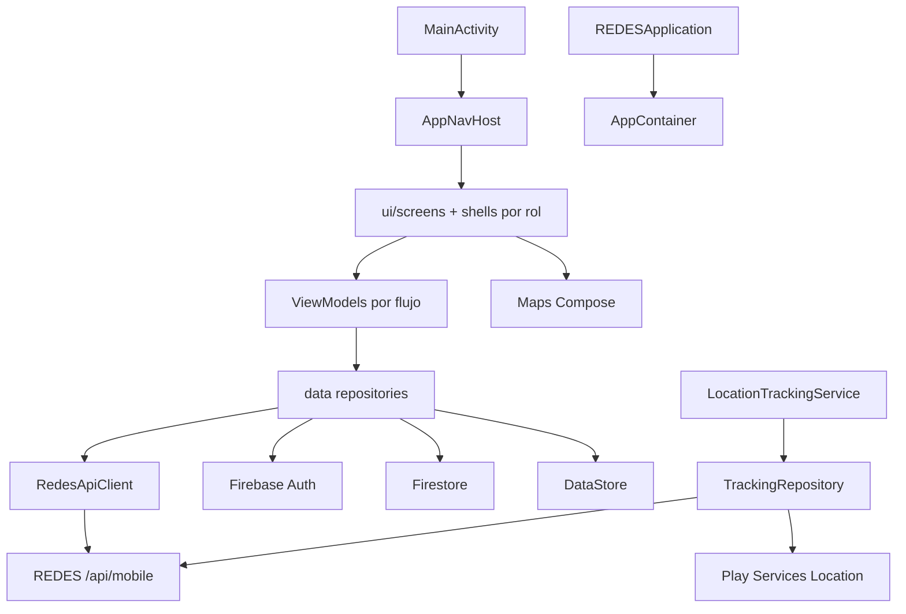
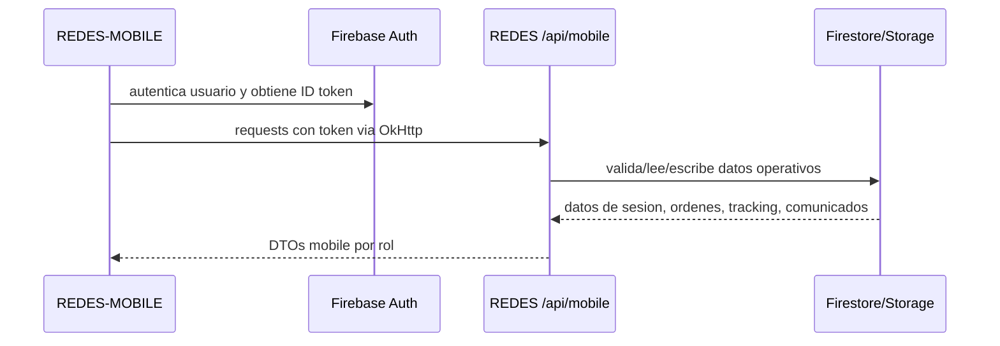
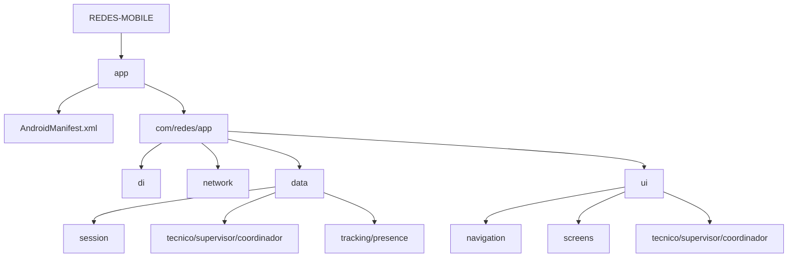
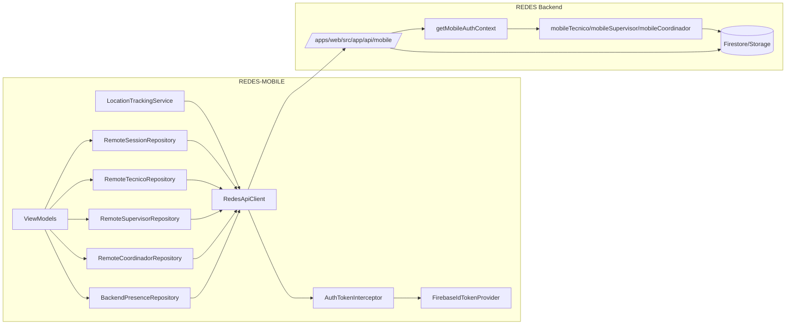
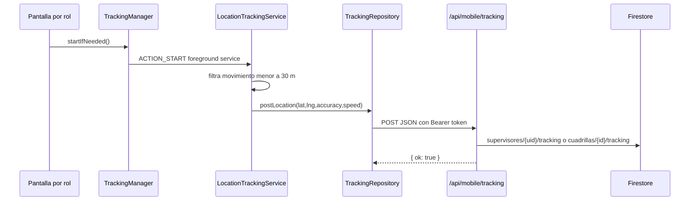
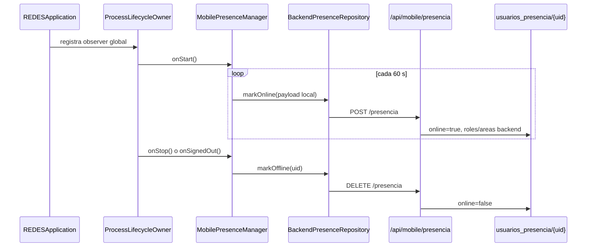
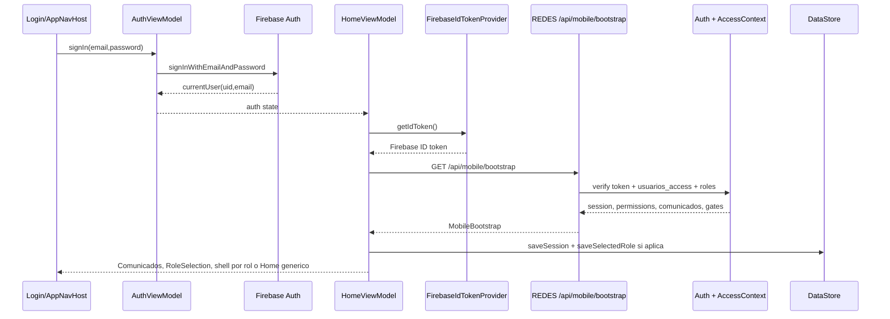

# Diagramas Iniciales - REDES-MOBILE

Estado: Fase 0, alto nivel.

## Arquitectura Android



## Relacion Con REDES



## Unidades Iniciales



## Network Layer Hacia API Mobile

Estado: deep dive 2026-06-13, unidad en **Revisar**.



## Tracking Background

Estado: deep dive 2026-06-14, unidad en **Revisar**.



## Presencia Mobile

Estado: deep dive 2026-06-14, unidad en **Revisar**.



## Sesion, Bootstrap Y Roles

Estado: deep dive 2026-06-14, unidad en **Revisar**.



## Decision De Entrada Mobile

```mermaid
flowchart TD
  Start[MainActivity] --> Update{Force update}
  Update -->|Checking| Splash[Splash]
  Update -->|UpdateRequired| Force[ForceUpdateScreen]
  Update -->|UpToDate| Auth{Firebase user}
  Auth -->|No| Login[LoginScreen]
  Auth -->|Si| Bootstrap[/api/mobile/bootstrap]
  Bootstrap -->|OK| Gate{Comunicados obligatorios?}
  Bootstrap -->|Error con cache| Cache[Sesion cacheada + error]
  Bootstrap -->|Error sin cache| HomeError[Home generico con error]
  Gate -->|Si| Comunicados[ComunicadosScreen]
  Gate -->|No| Roles{Varios roles sin selectedRole?}
  Roles -->|Si| Selector[RoleSelectionScreen]
  Roles -->|No| Selected{selectedRole}
  Selected -->|TECNICO| Tecnico[TecnicoShellScreen]
  Selected -->|SUPERVISOR| Supervisor[SupervisorShellScreen]
  Selected -->|COORDINADOR| Coordinador[CoordinadorShellScreen]
  Selected -->|Otro/null| Home[HomeScreen generico]
```
